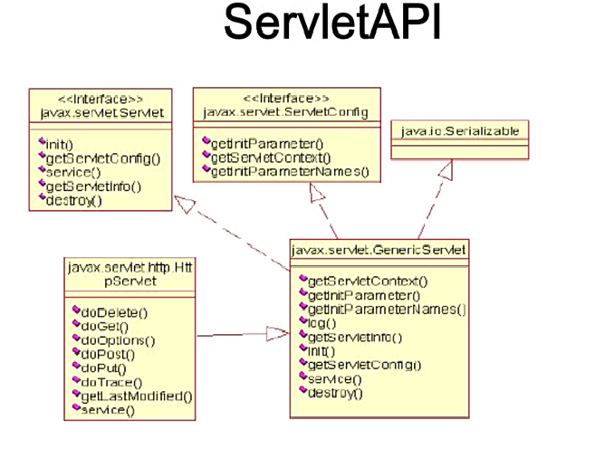

## java项目下创建WEB开发的目录结构

    -WebContent
        -WEB-INF
            -classes（编译后的class文件放在该目录下）
            -lib
            -web.xml
        html页面
        jsp页面
        图片

## 配置任意目录下Web应用程序  

项目目录映射
* 配置“D:\软件\apache-tomcat-9.0.12-windows-x64\apache-tomcat-9.0.12\conf\Catalina\localhost”文件夹下的“名.xml”文件 修改docBase和path

例如：
```xml
<!--hello.xml-->
<?xml version="1.0" encoding="UTF-8"?>
<Context docBase="D:\webTest|WebContent" path="/webTest" reloadable="true" source="org.eclipse.jst.jee.server:webTest"/>
```
访问的时候：
http://localhost:8080/hello/hello.jsp

hello即为xml的文件名  docBase是项目地址 path是项目名  
hello.jsp即为页面在WebContent下的相对路径

## Servlet

__Servlet__ 就是一个java类



servlet的Service方法用于应答请求
* ServletRequest:封装了请求信息，可以从中获取到任何请求信息
ServleReaponse:封装了响应信息，如果想给用户什么响应，具体可以使用该接口的方法实现

__Servlet容器__ 负责Servlet和客户的通信以及调用Servlet的方法，Servlet和客户的通信以及调用Servlet的方法，Servlet和客户的通信以及调用Servlet的方法，Servlet和客户的通信采用“请求/响应”的模式。

作用：
* 可以创建Servlet，并调用Servlet、jsp、filter的相关生命周期方法


Servlet容器响应客户请求的过程
 1. Servlet引擎检查是否已经转载并创建该Servlet的实例对象。如果是，则直接执行第4步
 2. 转载并创建该Servlet的一个实例对象：调用该Servlet的构造器
 3. diaoyongServlet实例对象的init()方法
 4. 创建一个用于封装请的ServletRequest对象和一个代表响应对象作为参数传递进去
 5. WEB应用程序被停止或重新启动之前，Servlet引擎卸载Servlet，并在卸载之前调用Servelet的destroy()方法。

 __ServletConfig类__

 封装了Servlet信息，并且可以获取ServletContext对象
* getInitParameterNames
* getIinitParameter
* getServletName
* getServletContext


__ServletContext接口__

  Servlet引擎为 __每个WEB应用程序__ 都创建了一个对应的ServletContext对象， ServletContext对象被包含在ServletConfig对象中，调用ServletConfig.getServletContext()方法可以返回ServletContext对象的引用。
   __由于一个WEB应用程序中的所有Servlet都共享同一个ServletContext对象__， 所以，ServletContext对象被称之为application对象（WEB应用程序对象）
   功能：
    * 获取WEB应用程序的初始化参数
    * 记录日志
    * application域范围的属性
    * 访问资源文件
    * 获取虚拟路径所映射的本地路径
    * WEB应用程序之间的访问
    * ServletContext的其他方法

## http
 
HHHP是hypertext transfer protocol(超文本传输协议)的简写，它是TCP/IP协议集中的一个应用层协议，__用于定义WEB浏览器与WEB服务器之间交换数据的过程以及数据本身的格式__


__ServletResquest__:
* 请求参数
    String getParameter(String)
    String[] getPatameterValues(String)
    Map getPatameterMap():
    Enumeration getParameterNames()
* 获取请求的URI：
httpServletRequest.getRequestURI()
httpServletRequest.getQueryString()
* 获取请求方式：
String HttpServletRequest.getMethod()
* 获取get方式时的请求字符串
String HttpServletRequest.getQueryString()

__ServletReponse__
* getWriter() 打印信息
* setContectType() 设置相应类型
* sendRedirct() 请求重定向