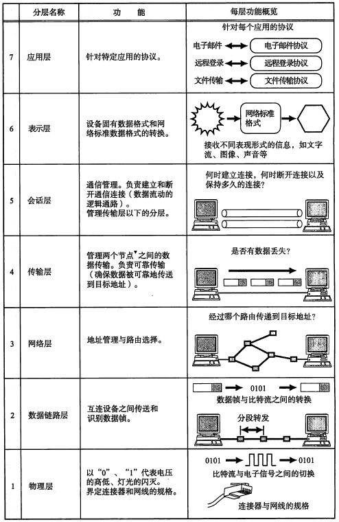

[TOC]


#Java基础学习笔记


##java语言概述
### Java语言的特点
   1. 面向对象
      * 两个基本概念：类、对象
      * 三大特性： 封装、继承、多态
   2. 健壮性
       * 吸收了c/c++语言的优点，但去掉了其影响程序的健壮性的部分（如：指针、内存的申请和释放等），提供了一个相对安全的内存管理
    3. 跨平台性
        * 跨平台性：write once,run anywhere
        原理：只要在需要运性Java应用程序的操作系统上，安装java虚拟机（JVM）即可。

### java运行机制及运行过程
#### java两种核心机制
 * java虚拟机（java Virtal Machine）
   jvm十一虚拟计算机，具有指令集并使用不同的存储区域。负责执行指令，管理数据、内存、寄存器。


 * 垃圾回收机制（Garbage Collection）
   垃圾回收在java程序运行过程中自动进行，程序员无法控制和干预

### java语言环境的搭建
#### 1. 什么是JDK,JRE?
简而言之，使用jdk开发程序，JRE运行程序
* JDK(Java Development kit  java开发工具包)
提供给Java开发人员使用，其中包含java的开发工具包，也包括了JRE。
其中的工具： 编译工具(javac.exe)  打包工具(jar.exe)

JDK中主要的包的介绍：
1. java.lang---包含以下java语言的核心类，如String、Math、Integer、System和Thread,提供常用的功能

2. java.net---包含执行与网络相关的操作的类和接口

3. java.io---包含能提供多种输入/输出功能的类

4. java.util---包含一些实用工具类，如定义系统特性、接口的集合框架类、使用与日期日历相关的函数

5. java.awt---包含了构成抽象窗口工具类{abstract window toolkit)的多个类，这些类被用来构建和管理应用程序的图形用户界面(GUI)

6. java.applet---包含applet运行所需的一些类

JRE(Java Run Environment java运行环境)

包括java虚拟机(JVM)和java程序所需的核心类库等，如果只想要运行一个开发好的程序，计算机中只需要安装JRE即可


#### 2. 环境变量
 * path: windows系统执行命令时要搜寻的路径
 * classpath: java在编译和运行时要找的class所在的路径

#### 开发前准备
1. 下载、安装JDK
2. 配置环境变量
3. 验证安装和配置是否成功
4. 选择合适的文本编辑器或IDE开发

#### 相比c++的java

* 没有指针
* 没有操作符重载
* 基本类型数据不随计算机系统的异同而改变
* 面向对象：
    * 类只能单继承，当使用了接口来实现了多继承
    * 使用了反射机制实现其动态特性
* 使用了垃圾回收机制


## java基础程序设计


### java注释、关键字和保留字、标识符

原文：https://blog.csdn.net/ZytheMoon/article/details/78648288

 * 注释类型：
    * 单行注释
    * 多行注释
    * 文档注释（java特有）
        * 格式
        * 能被javaDoc解析  
        javadoc -d xx(文件夹名)) -author -version xx.java
```java
/**
这是一个文档注释
@author xx
@version v1.0
@param 参数说明
*/
class HelloWorld{
    /*
    1、源文件以.java结尾
    2、源文件可以有多个class声明的类
    3、类中可以有主方法（即main()方法）
    4、main()方法是程序的入口，方法内是程序的执行部分
    5、一个源文件中只能有一个声明为public的类，同时要求此类类名与源文件名一致
    6、执行程序：1）编译 javac xx.java 2）运行 java xx  
    */
    //这是单行注释
    //这是程序的主入口
    public static void main(String[] args){
        /*
        这是多行注释
        以下是程序的输出语句
        */
        System.out.println("Hello World!!!");
    }
}
```

* 关键字

  > 定义：被java语言赋予了特殊含义，用作专门用途的字符串
  特点：关键字中所有字母都为小写

  * 定义数据类型的关键字: 
    class、interface、void、enum、byte、short、int、long、float、double、char、boolean

  * 定义变量值的关键字：
   true、false、null

  * 定义流程控制的关键字：
   if、else、switch、case、default、while、do、for、break、continue、

  * 定义访问权限修饰符的关键字：

   |权限修饰符|意思|作用范围|
   |--|--|--|
   |public|公有的|可跨包，（默认选择|
   |protected|受保护的|当前包内可用|
   |provate|私有的|当前类可用|
   |缺省||当前类可用

  * 类与类之间的关系：
    implements、ectends

   * 修饰方法、属性、变量

    |关键字| 意思|备注，常用|
    |--|--|--|
    |static |静态的 |属性和方法、内部类、静态代码块都可以用static修饰|
    |final|最终的、不可被改变的|final修饰的类是不能被继承的、修饰的方法是不能被子类重写、final修饰的属性就是常量|
    |super|调用父类的方法|常见public void paint(Graphics g){super.paint(g); ··· }|
    |this|当前类的父类的对象|调用当前类中的方法,this表示调用这个方法的对象|
    |native|本地|见下| 	 
    |strictfp|精确浮点|strictfp来声明一个类、接口或者方法时，那么所声明的范围内Java的编译器以及运行环境会完全依照浮点规范IEEE-754来执行。因此如果想让浮点运算更加精确，不允许对接口中的方法以及构造函数声明strictfp关键字| 
    |synchronized|线程,同步||
    |transient|短暂|用来表示一个域不是该对象串行化的一部分| 
    |volatile|易失|volatile 变量可以被看作是一种 “程度较轻的 synchronized”；与 synchronized 块相比，volatile 变量所需的编码较少，并且运行时开销也较少，但是它所能实现的功能也仅是 synchronized 的一部分|

  native ：以指示该方法是用 Java 以外的语言实现的。Java的不足除了体现在运行速度上要比传统的C++慢许多之外，Java无法直接访问到操作系统底层（如系统硬件等)，为此Java使用native方法来扩展Java程序的功能。 
　　可以将native方法比作Java程序同Ｃ程序的接口，其实现步骤： 
　　１、在Java中声明native()方法，然后编译； 
　　２、用javah产生一个.h文件； 
　　３、写一个.cpp文件实现native导出方法，其中需要包含第二步产生的.h文件（注意其中又包含了JDK带的jni.h文件）； 
　　４、将第三步的.cpp文件编译成动态链接库文件； 
　　５、在Java中用System.loadLibrary()方法加载第四步产生的动态链接库文件，这个native()方法就可以在Java中被访问了。

  * 流程控制语句中
    if、else、do、while、for、switch、case、default、instanceof、break、continue、return

  * 异常处理的关键字：
   try、catch、finally、throw、throws

  * 用于包的关键字：
   package、import


* 标识符
    > 标识符：凡是可以自己命名的地方

    规则：
    * 由26个英文字母大小写，0-9，_或$组成
    * 数字不可以开头
    * 不可以使用关键字和保留字
    * 严格区分大小写
    * 不能含有空格

    命名规范：
    * 包名： 多单词组成时所有字母都小写 
    * 类名、接口名：多单词组成时，所有单词的首字母大写 XxYyZz
    * 变量名、方法名： 多单词组成时，第一个单词首字母小写，第二个单词开始首字母大写  xxYyZz
    * 常量名： 所有字母都大写。多单词时，每个单词用下划线连接 xx_yy_zz

### 变量

>变量的概念
    > * 内存中的一个存储区域
    > * 该区域有自己的名称和类型
    > * java中每个变量必须先声明，后使用
    > * 该区域的数据可以在同一类型范围内不断变化

>使用时应注意：
    > * 变量的作用域
    > * 变量的初始化值
    > * 通过变量名来访问内存区域

### 数据类型


* 整形
|类型|占用存储空间|表数范围|
|---|---|---|
|byte|1个字节|-128~127|
|short|2个字节|-2^15~2^15-1|
|int|4个字节|-2^31~2^31-1|
|long(值的末尾加"L"或"l")|8个字节|-2^63~2^63-1|

* 浮点型
java的浮点型常量默认为double型，声明为float型常量，须后加'f'或'F'
|类型|占用存储空间|表数范围|
|---|---|---|
|float|4个字节|-3.403E38~3.403E38|
|double|8个字节|-1.798E308~1.798E308|

### 运算符

* __算数运算符__
+、-、 + 、-、*、/、%、--、++、--、++、+

* __赋值运算符__
=、+=、-=、*=、/=、%=:即可以实现运算也不会改变原数据的数据类型

```java
int i1 = 10;
//i1 = i1 + 0.2;//编译不通过
i1 = (int)(i1 + 0.2); //不推荐使用
i1+=0.2;
System.out.println(i1);//10
```
* __比较运算符__
==、!=、<、>、<=、>=、instanceof(检查是否是类的对象)

* __逻辑运算符__
 
    & -逻辑与    | -逻辑或   ! -逻辑非
    && —短路与   || -短路或  ^ -逻辑异或

“逻辑”与"短路"的区别:
“逻辑”:不管左端时true还是false，右端都会进行运算
"短路":当左端为false时右端不再进行运算
```java
//&与&&的区别
//&:不管左端时true还是false，右端都会进行运算
//&&:当左端为false时右端不再进行运算
int i1 = 10;
boolean b = false;
if(b & (i1 + 1) >10){
    System.out.println("今天天气很晴朗");
}else{
    System.out.println(i1);//10
}
if(b & (i1 + 1) >10){
    System.out.println("今天天气很晴朗");
}else{
    System.out.println(i1);//10
}
```
 
* __位运算符__
<<左移、>>右移、>>>无符号右移、|或、 &与、~取反、^异或
ex:交换两个变量的值
```java
    //方法一：提供一个临时变量
    int m = 2, n = 3;
    int temp = m;
    m = n;
    n = temp;
    //方法二；当m和n权大时，有可能出现精度损失
    m = m + n;
    n = m - n;
    m = m - n;
    //方法三：不会出现上述两种方法的缺点
    m = m ^ n;
    n = m ^ n;
    m = m ^ n;
```

ex:求int数字的十六进制
```java
int i= 60;
//方法一：
System.out.println(Integer.toHexString(i));
System.out.println(Integer.toBinaryString(i));
//方法二：
String k = "";
while(i > 0){//60先右移 
    int z = i & 15; //获得高四位值 
    k = (z<=9)? z + k : (char)(z-10 +'a')+ k; 
    i = i >> 4;
}
System.out.print(k); //3c
```

### 程序流程控制
* 顺序结构
* 分支结构
if...else、switch(变量类型：char、int、b yte、short、枚举、String(JDK1.7以上))
* 循环结构
while、do...while、for

ex:输出所有的水仙花数，所谓的水仙花数：一个3位数，其各位上数字的立方和等于其本身
```java
for(int i = 100; i < 1000; i++) {
    int j1 = i / 100;
    int j2 = (i - i * 100) / 10;
    int j3 = i % 10;
    if(i == j1 * j1 * j1 + j2 * j2 * j2 + j3 * j3 * j3) {
        System.out.println(i);
    }
}
```

ex:从键盘读入整数，并判断输入的整和负数的个数，直到输入为0为止
```java
Scanner s = new Scanner(System.in);
int pos; //记录正数的个数
int pas; //记录负数的个数
while(true){
    System.out.println("请输入一个整数");
    if(num > 0){
        a++;
    }else(num < 0){
        b++;
    }else{
        break;
    }
}
```
ex:输出从1到10000之间的质数
```java
long start = System.currentTimeMillis();
for(int i = 2; i < 10000; i ++){
    boolean flag = false;
    for(int j = 2; j < Math.sqrt(i); j++){//for(int j = 2; j < i; j++)
        if(i % j == 0){
            flag = true;
            break;
        }
    }
    if(!flag){//if(flag == true)
        System.out.println(i);
    }
}
long end = System.currentTimeMillis();
System.out.println(end-start);
```

### 数组

数组：相同数据类型数据的组合
数组是引用类型
一旦初始化，长度不可变
 
* __一维数组的使用__

    * 声明
        String[] names;
        int[] score;
    * 初始化
        * 静态初始化
        names = new String[]{"小红", "小黄", "小路"}
        * 动态初始化
        score = new Score[3];
    * 调用
        score[0] = 12;
* 一维数组的内存结构


* __数组的常见算法__

   * 1. 求数组元素的最大值、最小值、总和

   * 2. 数组的复制、反转

ex:复制
```java
int[] arr1, arr2;
arr1 = new int[]{1,3,2,5,4,6,7,8};

//直接arr1 = arr2??? arr的地址给了arr2，修改arr2时，相当于在操作arr1指向的数据空间
arr2 = arr1;
System.out.println(arr1[0]);//1
arr2[0] = 10;
System.out.println(arr1[0]);//10

arr2 = new int[arr1.length];
for(int i = 0; i < arr1.length; i++) {
    arr2[i] = arr1[i];
}
arr2[0] = 20;
System.out.println(arr1[0]);//10
```

ex:反转
```java
int[] arr;
arr = new int[]{1,2,3,4,5,6,7,8};

for(int i = 0; i < arr.length/2; i++) {
    int temp = arr[i];
    arr[i] = arr[arr.length - 1 - i];
    arr[arr.length - 1 - i] = temp;
}

for(int i = 0; i < arr.length; i++) {
    System.out.print(arr[i] + " ");//8 7 6 5 4 3 2 1
}
```

ex：杨辉三角
ex:利用二维数组打印一个10行杨辉三角
1
1 1
1 2 1
1 3 3 1
1 4 6 4 1
1 5 10 10 5 1
....
规律：
1. 第一行有一个元素，第n行有n个元素
2. 每一行的第一个元素和最后一个元素都是1
3. 从第三行开始，对于非第一个元素和最后一个元素的元素
   yanghui[][j] = yanghui[i-1][j-1] + yanghui[i-1][j]

```java
int[][] yanghui  = new int[10][];
for(int i = 0; i < 10; i++){
    yanghui[i] = new int[i + 1];
}

for(int i = 0; i < yanghui.length; i++){
    for(int j = 0; j < yanghui[i].length; j++){
        if(0 < j & j < (yanghui[i].length - 1)){
                yanghui[i][j] =  yanghui[i-1][j-1] + yanghui[i-1][j];
                continue;
        }
        yanghui[i][j] = 1;
    }
}
for(int i = 0; i < yanghui.length; i++){
    for(int j = 0; j < yanghui[i].length; j++){
        System.out.print(yanghui[i][j] + "\t");
    }
    System.out.println();
}
```

ex: 常用的内部排序

 __插入排序__
    1. 直接选择排序
    * 在一组元素R[i]到R[n]中选择具有最小关键码的元素
    * 若它不是这组元素中的第一个元素，则将它与这组元素中的第一个元素对调
    * 除去具有最小关键字的元素，在剩下的元素中重复第(1)、(2)步，直到剩余元素只有一个为止
    

```java
int[] arr = new int[]{49, 38, 65, 97, 76, 13, 27, 49};

for(int i = 0; i < arr.length - 1; i++) {
    for(int j = i + 1; j < arr.length; j++) {
        if(arr[i] > arr[j]) { //< : 从大到小
            int temp = arr[i];
            arr[i] = arr[j];
            arr[j] = temp;
        }
    }
}

for(int i = 0; i < arr.length; i++) {
    System.out.print(arr[i] + " ");//1 2 3 4 5 6 7 8 
}
```

__交换排序__

1. 冒泡排序

* 若序列中有个元素，则要进行<strong>n-1</strong>次循环，第一次循环，针对第R[1]至R[n}个元素进行，第2次循环，针对R[1]至R[n-1]个元素进行，....第n-1次，针对R[1]、R[2]进行
* 在第i次循环时，依次将a[j]与a[j+1] (0&lt;=j&lt;=n-i)进行比较，若a[j]&lt;a[j+1]则交换位置，因此此次循环结束后，会得到a[n-i]为此次循环遍历所有元素的最大值

```java
int[] arr;
arr = new int[]{8,2,5,4,3,6,7,1};

for(int i = 0; i < arr.length; i++) {
    for(int j = 0; j < arr.length - 1 - i; j++) {
        if(arr[j] > arr[j+1]) { //< : 从大到小
            int temp = arr[j];
            arr[j] = arr[j+1];
            arr[j+1] = temp;
        }
    }
}

for(int i = 0; i < arr.length; i++) {
    System.out.print(arr[i] + " ");//1 2 3 4 5 6 7 8 
}
```


## java面向对象
"万事万物即对象"
学习面向对象内容的三条主线：
* java类及类成员
* 面向对象的三大特征：封装、继承、多态、抽象
* 其它关键字

一、面向对象的落地法则
1. 设计类，并设计类的成员(成员变量&成员方法)
2. 通过类，来创建类的对象(类的实例化)
3. 通过“对象.属性”或“对象.方法”调用，来完成相应的功能

二、类与类之间的关系
关联、继承、聚集、组合


### 类

#### 关键字this
1. 可以用来修饰属性、方法、构造器
2. this理解为当前对象或当前正在创建的对象
3. 可以在构造器中通过"this(形象)"的方式显示的调用本类中其它重载的指定的构造器
    要求：
        1. 在构造器内部必须声明在首行
        2. 若一个类中有n个构造器，那么最多有n-1个构造器中使用了this(形参)

#### 类的成员之一：初始化块(或代码块)
> 修饰符仅为staic

非静态代码块
1. 可以对类的属性*(静态或非静态)进行初始化操作，同时也可以调用本类声明的方法(静态的或非静态的)
2. 里面可以有输出语句
3. 一个类中可以有多个非静态的代码块，多个代码块之间顺序执行
4. 每创建一个类的对象非静态代码块执行一次
5. 执行早于构造器

静态代码块
1. 里面可以有输出语句
2. 随着类的加载而加载，只被加载一次
3. 多个静态代码块之间按照顺序执行
4. 静态代码块执行早于非静态代码块
5. 静态的代码块中只能执行静态的结构(类属性、类方法)


#### 抽象类

__abstract__: 

1. 修饰类：抽象类
    * 不可被实例化
    * 有构造器(凡是类都有构造器) 
    * 抽象方法所在的类一定是抽象类
    * 抽象类中可以没有抽象方法
2. 修饰方法：
    * 格式，没有方法体及{}
    * 具体的方法体交给子类完成
    * 若子类继承抽象类，并重写了所有的抽象方法，则子类为实例类，否则子类也为抽象类

注： abstract不能用来修饰属性、private、final、static

> 抽象是一种思想，抽象类体现的就是模板模式的设计，<strong>抽象类作为多个子类的通用模板</strong>，子类在抽象类的基础上进行扩展、改造，但子类总体上会保留抽象类的行为方式

解决问题：
* 当功能内部一部分实现是确定的，一部分是不确定的，这是可以把不确定的部分暴露出去，让子类去实现
* 编写一个抽象父类，弗雷提供了多个子类的通用方法，并把一个或多个方法留给其子类实现，就是一种模板模式

### 三大特性

#### 封装和隐藏


#### 继承性
1、为什么要设计继承？

2、java中的继承只能是单继承
   用法： A(子类) extends B(父类)

3、子类继承父类以后，父类中声明的属性、方法，子类就可以获取到
    当父类中私有的属性或方法时，子类同样可以获取到，只是由于封装性，子类不能访问

#### 多态性
多态性，在java中有两种体现：
1. 方法的重载(overload)和重写(overwrite)
2. 子类对象的多态性(对父类方法的重写)
3. 程序运行具有编译状态和运行状态
   对多态性来说，编译时，“看左边”, 将此引用变量理解为父类的类型
   运行时，看右边，关注真正对象的实体，子类的对象，那么执行的方法就是子类重写的
```java
class person{
    void walk(){

    }
}
class girl{
    void shopping(){

    }
}
Person p = new girl();
p.walk();
((girl)p).shopping();//向下转型，强制转换
```

### 接口(interface)

1. 接口可以看作是一个特殊的抽象类，是产量与抽象方法的一个集合
2. 接口是没有构造器的
3. 接口定义的是一种功能，此功能可以被类所实现(implements)
4. 实现接口的类，必须重写其中所有的抽象方法，否则，此类认为抽象类
5. 类可以实现多接口
6. 接口与接口之间是继承关系，而且可以实现多继承

```java
class A{
    //常量：所有的常量都用public static final
    // public static int I = 23;
    int I = 23;
    //抽象方法：所有的都用public abstract修饰
    //public abstract void method();
    void method();

}
```

8.  __接口的多态性__
```java
interface Swimmer{
	void swim() ;
}

interface Runner{
	void run();
}

interface Flier{
	void fly();
}

class Duck implements Runner, Swimmer, Flier{

	@Override
	public void fly() {
			System.out.println("丑小鸭也可以变成白天鹅！");
	}

	@Override
	public void swim() {
		System.out.println("游泳噗噗噗");
	}

	@Override
	public void run() {
		System.out.println("走了踏踏踏");
	}
	
}
Duck d = new Duck();

Runner r = d;
d.run();

Swimmer s = d;
s.swim();

Flier f = d;
f.fly();
```

接口的用法总结：
* 通过接口可以实现不相关类的相同行为，而不需要考虑这些类之间的层次关系
* 通过接口可以指明多个类需要实现的方法，一般用于定义对象的扩张功能
* 接口主要用来定义规范，接触耦合关系

#### 接口的应用：工厂方法(FactoryMethod)

> 定义一个用于创建对象的接口，让子类决定实例化哪一个类，FactoryMethod使一个类的实例化延迟到其子类

适用性：
1. 当一个类不知道它所必须创建的对象的时候
2. 当一个类希望由它的子类来指定它所创建的对象的时候
3. 当类将创建对象的指责委托给多个帮助子类中的某一个，并且你希望哪一个帮助子类是代理者这一信息局部化的时候

ex:


```java
public class TestFactory{
    public static void main(String[] args) {
        IWorkFactory i = new StudentWorkFactory();
        i.getWork().doWork();
    }
}

interface Work{
	void doWork();
}

interface IworkFactory{
	Work getWork();
}

class StudentWork implements Work{

	@Override
	public void doWork() {
		System.out.print("student do homework!");
	}
}

class TeacherWork implements Work{

	@Override
	public void doWork() {
		System.out.print("teacher check homework!");
	}	
}

class StudentWorkFactory implements IworkFactory{

	@Override
	public Work getWork() {
		return new StudentWork();
	}
}

class TeacherWorkFactory implements IworkFactory{

	@Override
	public Work getWork() {
		return new TeacherWork();
	}
}
```

#### 接口的应用：代理模式

> 为其他对象提供一种代理以控制对这个对象的访问


```java
public class TestProxy{
    public static void main(String[] args) {
        Object obj = new ProxyObject();
		obj.action();
    }
}
//代理类
class ProxyObject implements Object{
	Object obj;
	
	public ProxyObject() {
		System.out.println("代理类已创建");
		obj = new ObjectImpl();
	}

	@Override
	public void action() {
		System.out.println("代理类开始执行");
		obj.action();
		System.out.println("代理类执行结束");
	}
}

//被代理类
class ObjectImpl implements Object{

	@Override
	public void action() {
		System.out.println("===被代理类开始执行====");
		System.out.println("。。。。。。。。。。。。");
		System.out.println("===被代理类执行完毕====");
	}
}
```

#### 类的成员之一：内部类

1. 在类的内部
2. 内部类的分类：
    成员内部类（声明在类内部且方法外） vs 局部内部类(声明在方法内)
 成员内部类：
    * 是外部类的一个成员： 可以有4个访问控制修饰符、static、final
    * 具有类的特点: 可以有修饰符abstract,还可以在内部定义属性、方法、构造器
    * 可以调用外部类的属性、方法
    局部内部类：
3. 如何创建内部类、外部类的变量(尤其是变量重名时)？
```java
public class TestInnerClass{
    public static void main(String[] args){
        //创建静态内部类对象
        Person.Dog d = new Person.dog();
        //Person.Bird b = new Person.Bird();办不到
        //创建非静态的内部类对象：通过外部类对象创建
        Person p = new Person();
        Person.Bird b = p.new Bird();
    }
}

class Person{
    String name;
    int id;

    //非静态的内部类
    class Bird{
        public Bird(){
        }
    }

    //静态的内部类
    static class Dog{
        public Dog(){}
    }
}
```
4. 外部类与内部类如何区分？
```java
public class TestInnerClass{
    public static void main(String[] args){
        //创建静态内部类对象
        Person.Dog d = new Person.dog();
        //Person.Bird b = new Person.Bird();办不到
        //创建非静态的内部类对象：通过外部类对象创建
        Person p = new Person();
        Person.Bird b = p.new Bird();
    }
}

class Person{
    String name = " Rose";
    int age = 18;

    //非静态的内部类
    class Bird{
        String name = "白鹭";

        public Bird(){
        }

        public void getName(String name){
            System.out.println(name);//白鹭
            System.out.println(this.name);//白鹭
            System.out.println(Person.this.name);//Rose
        }
    }

    //静态的内部类
    static class Dog{
        public Dog(){}
    }
}
```
4. 局部内部类的使用
```java
class OuterClass{
    public void method(){
        class InnerClass{

        }
    }

    //常用作以下方式
    public Comparable getComparable(){
        //创建一个实行Comparable接口的对象
        class MyComparable implemenets Comparable{
            @Override
            public int compareTo(Object o){
                return o;
            }
        }
        return new MyComparable();
    }

    //常用作以下方式
    public Comparable getComparable(){
        //创建一个实行Comparable接口的对象
        return new MyComparable(){
            @Override
            public int compareTo(Object o){
                return o;
            }
        }
    }
}
```

### 方法

##### 重载
> 同一个类中
1. 方法名必须相同
2. 方法的参数列表不同：参数的个数不同||参数类型不同
3. 方法的重载与方法的返回值类型无关
##### 重写：
>有子类继承父类，对父类同名方法的重写(覆盖、override overwrite)
1. 要求子类方法的"返回值类型 方法名(参数列表)"与父类方法一样
2. 子类方法的修饰符不能小于父类方法的修饰符
3. 若父类方法抛异常，则子类方法抛异常不能大于父类


##### 方法的值传递机制
1. 形参是基本数据类型的，将实参的值传递给形参的基本数据类型的变量
2. 形参是引用数据类型的，将实参的应用类型变量的值（对应的堆空间的对象实体的首地址值）传递给形参的引用


### 单例设计模式
> 设计模式是在大量的实践中总结和理论化之后优选的代码结构、编程风格，以及解决问题的思考方式。23种设计模式

单例（Singleton）设计模式
> 所谓的单例设计模式，就是采取一定的方法保证在整个的软件系统中，对某个类只能存在一个对象实例，并且该类只提供一个取得其对象实例的方法。
1. 解决问题的问题：使得一个类只能够创建一个对象
2. 如何实现？

* 饿汉式
```java
//只能创建Singleton的单个实例
class Singleton{
	//1.私有化构造器, 似的在类的外部不能调用类的构造器
	private Singleton() {}
	
	//2. 在类的内部创建一个类的实例
	private static Singleton instance = new Singleton();
	//3. 私有化此对象，通过公共的方法来调用
	//4. 此公共的方法，只能通过类来调用，因此设置为satic, 同时类的实例也必须为static
	public static Singleton getInstance() {
		return instance;
	}
}
```

* 懒汉式
```java
//只能创建Singleton的单个实例
class Singleton1{
	//1.私有化构造器, 似的在类的外部不能调用类的构造器
	private Singleton1() {}
	
	//2. 在类的内部创建一个类的实例
	private static Singleton1 instance = null;
	//3. 私有化此对象，通过公共的方法来调用
	//4. 此公共的方法，只能通过类来调用，因此设置为satic, 同时类的实例也必须为static
	public static Singleton1 getInstance() {
		if(instance == null) {
			instance = new Singleton1();
		}
		return instance;
	}
}
```

### 其它

#### static
static修饰属性（类变量）：
1. 有类创建的所有的对象，都共用一个属性
2. 类变量<strong>随着类的加载</strong>而加载而且<strong>独一份</strong>
3. 类变量的加载要早于对象
4. 类变量存在于静态域中


static修饰方法(类方法)：
1. 随着类的加载而加载，在内存中是独一份
2. 不能调用非静态的方法或属性，但非静态的方法可以调用静态的方法和属性
3. 静态的方法不可以this和super关键字

注：静态的结构（static的属性、方法、代码块、内部类）的生命周期要早于非静态的结构，同时被回收也要晚于非静态的结构

#### final
> final：最终的，可修饰类属性、方法
* 修饰类：这个类就不能被继承，如：String类、StringBuffer类、System类

* 修饰方法：不能被重写，如：Object类的getClass()

* 修饰属性：此属性是一个常量，一旦初始化，不可以再赋值习惯上用大写字符表示。
    此常量：1. 此常量不能使用默认初始化 2.可以显示的赋值、代码块、构造器

变量用static final修饰，为全局常量

#### == 和equals的区别
1. 对于==，如果作用于基本数据类型的变量，则直接比较其存储的 “值”是否相等；
 如果作用于引用类型的变量，则比较的是所指向的对象的地址
2. 对于equals方法，注意：equals方法不能作用于基本数据类型的变量
　 如果没有对equals方法进行重写，则比较的是引用类型的变量所指向的对象的地址；

#### 重写equals()方法
```java
public boolean equals(Object obj){
    if(this == obj){
        return true;
    }
    if(obj == null){
        return false;
    }
    if(getClass() != obj.getClass()){
        return false;
    }
    Person other = (Person)obj;
    if(age == null){
        if(other.age != null){
            return false;
        }
    }else if(!age.equals(other.age)){
        return false;       
    }
     
    if(name == null){
        if(other.name != null){
            return false;
        }
    }else if(!name.equals(other.name)){
        return false;
    }

}
```

#### toString()
java.lang.toString()方法的定义：
public String toString(){
    return getClass().getName + "@" + Integer.toHexString(hashcode());
}

#### java异常

> 将程序执行中发生的不正常的情况称为"异常"（开发过程中的语法错误和逻辑错误不是异常）

java程序在执行过程中所发生的异常可分为两类：
1. Error: java虚拟机无法解决的严重问题，如：jvm系统内部错误、资源耗尽等严重情况，一般不编写针对性的代码进行处理
2. Exception: 其它因编程错误或偶然的外在因素导致的一般性问题，可以使用针对性的代码进行处理。例如:
   * 空指针访问
   * 试图读取不存在的文件
   * 网络中断连接

      
         java.lang.Throwable
            |
            |------Error:错误, 程序中部进行处理
            |
            |------Exception: 异常，要求在编写程序时，就要考虑到对这些异常的处理
                    |
                    |---编译时异常，在编译期间会出现的异常(执行javac.exe命令时，出现异常)
                    |---运行时异常，在运行期间出现的异常(执行java.exe命令时，出现异常)


```java
//常见的运行时异常
//数组下标越界异常:ArrayIndexOutOfBoundsException
int[] i = new int[10];
System.out.println(i[10]);

//算术异常:ArithmeticException
int i = 10;
System.out.println(i / 0);

//类型转换异常:ClassCastException
Object obj = new Date();
String str = (String)obj;

//空指针异常:NullPointerException
String p = new String();
p = null;
System.out.print(p.toString());
```

#### java的四种引用
* __强引用-FinalReference__

>介绍：
强引用是平常中使用最多的引用，强引用在程序内存不足（OOM）的时候也不会被回收，使用方式：

    String str = new String("str");


这个str就是强引用。
可用场景：
地球人都知道，但是我讲不出来。

* __软引用-SoftReference__

>介绍：
软引用在程序内存不足时，会被回收，使用方式：

    // 注意：wrf这个引用也是强引用，它是指向SoftReference这个对象的，
    // 这里的软引用指的是指向new String("str")的引用，也就是SoftReference类中T
    SoftReference<String> wrf = new SoftReference<String>(new String("str"));


可用场景：
创建缓存的时候，创建的对象放进缓存中，当内存不足时，JVM就会回收早先创建的对象。PS：图片编辑器，视频编辑器之类的软件可以使用这种思路。
软引用使用例子传送门：https://www.cnblogs.com/mjorcen/p/3968018.html

* __弱引用-WeakReference__

> 介绍：
弱引用就是只要JVM垃圾回收器发现了它，就会将之回收，使用方式：

    WeakReference<String> wrf = new WeakReference<String>(str);


可用场景：
Java源码中的java.util.WeakHashMap中的key就是使用弱引用，我的理解就是，一旦我不需要某个引用，JVM会自动帮我处理它，这样我就不需要做其它操作。
弱引用使用例子传送门：http://www.importnew.com/21206.html

* __虚引用-PhantomReference__

> 介绍：
虚引用的回收机制跟弱引用差不多，但是它被回收之前，会被放入ReferenceQueue中。注意哦，其它引用是被JVM回收后才被传入ReferenceQueue中的。由于这个机制，所以虚引用大多被用于引用销毁前的处理工作。还有就是，虚引用创建的时候，必须带有ReferenceQueue，使用例子：

    PhantomReference<String> prf = new PhantomReference<String>(new String("str"), new ReferenceQueue<>());

可用场景：
对象销毁前的一些操作，比如说资源释放等。Object.finalize()虽然也可以做这类动作，但是这个方式即不安全又低效(传送门：http://blog.csdn.net/aitangyong/article/details/39450341)，so。

__上诉所说的几类引用，都是指对象本身的引用，而不是指Reference<T>的四个子类的引用__(SoftReference&lt;T&gt;等)。
([https://blog.csdn.net/u014532217/article/details/79184412])


### 一些常用的java类

#### String类
String类对equals()进行了重写
```java
String str1 = "ABC";
String str2 = "ABC";
String str3 = new String("ABC");
System.out.println(str1 == str2);//true
System.out.println(str1 == str3);//false
System.out.println(str1.equals(str2));//true
System.out.println(str1.equals(str3));//true
```


```java
String s8 = "ja";
String s9 = "va";
String s10 = "java";
String s11 = s8 + s9;
System.out.println(s10 == s11); //false
System.out.println(s10.equals(s11)); //true
String s12 = "ja" +"va";
System.out.println(s10 == s12); //true

//final使其存放在常量池中
final String s13 = "ja";
final String s14 = "va";
String s15 = s13 + s14;
String s16 = "java";
System.out.println(s15 == s16);//true
String s17 = "ja" + s14;
System.out.println(s17 == s16);//true
String s18 = s13 + "va";
System.out.println(s18 == s16);//true
```

这里s13、s14被你声明成了final的了，所以就是常量，常量表达式String s17 = "ja" + s14;String s18 = s13 + "va";，JVM会优化成String s17 = "ja" + "va";String s18 = "ja" + "va";，这个结果是变成编译期就是已知了，指向常量池中的"java"字符串。也就是String s17 = "ja" + s14;String s18 = s13 + "va"，就相当于是String s17 = "ja" + "va";String s18 = "ja" + "va".
s11 = s8 + s9，因为这里的s8、s9虽然是在常量池中，但是在编译期是不能获得值的，只有在运行的时候才会调用函数，初始化赋值，所以这时的s17、s18是运行期间计算出来的，而加号连接运算符，内部则是调用的StringBuilder，然后toString，所以c相当于是new出来的String，即c是指向堆内存的地址，c内部的char数组才指向常量池中的字符串，也就是说是是s17是new出来的
`

### java中的数据结构的包装： 集合

#### 集合框架
 早在 Java 2 中之前，Java 就提供了特设类。比如：Dictionary, Vector, Stack, 和 Properties 这些类用来<strong>存储和操作对象组</strong>。

虽然这些类都非常有用，但是它们缺少一个核心的，统一的主题。由于这个原因，使用 Vector 类的方式和使用 Properties 类的方式有着很大不同。

集合框架被设计成要满足以下几个目标。

    该框架必须是高性能的。基本集合（动态数组，链表，树，哈希表）的实现也必须是高效的。

    该框架允许不同类型的集合，以类似的方式工作，具有高度的互操作性。

    对一个集合的扩展和适应必须是简单的。

为此，整个集合框架就围绕一组标准接口而设计。你可以直接使用这些接口的标准实现，诸如： LinkedList, HashSet, 和 TreeSet 等,除此之外你也可以通过这些接口实现自己的集合。


从上面的集合框架图可以看到，Java 集合框架主要包括两种类型的容器，一种是集合（Collection），存储一个元素集合，另一种是图（Map），存储键/值对映射。Collection 接口又有 3 种子类型，List、Set 和 Queue，再下面是一些抽象类，最后是具体实现类，常用的有 ArrayList、LinkedList、HashSet、LinkedHashSet、HashMap、LinkedHashMap 等等。

集合框架是一个用来代表和操纵集合的统一架构。所有的集合框架都包含如下内容：

   *  接口：是代表集合的抽象数据类型。例如 Collection、List、Set、Map 等。之所以定义多个接口，是为了以不同的方式操作集合对象

    * 实现（类）：是集合接口的具体实现。从本质上讲，它们是可重复使用的数据结构，例如：ArrayList、LinkedList、HashSet、HashMap。

    * 算法：是实现集合接口的对象里的方法执行的一些有用的计算，例如：搜索和排序。这些算法被称为多态，那是因为相同的方法可以在相似的接口上有着不同的实现。

java集合可分为Collection和Map两种体系
* Collection接口：
    * Set： __元素无序、不可重复的集合__
    * List：__元素有序，可重复的集合__
* Map接口: 具有映射关系“key-value对”的集合
      
        Collection接口
            |
            |----List接口：存储元素有序，可重复的元素
            |       |-----ArrayList(主要实现的类)、LinkedList(频繁的插入、删除操作)、Vector(古老的、线程安全的、但效率低于ArrayList)
            |
            |----Set接口：存储无序、不可重复的元素
            |       |-----HashSet(主要实现类)、LinkedHashSet(使用链表维护了元素添加进集合的顺序)、TreeSet

        Map接口：存储“键-值”对数据
            |
            |----HashMap(Map的主要实现类)、LinkedHashMap(使用链表维护添加进map的顺序)、TreeMap(按照添加进Map中的key的指定属性进行排序)、
            TreeMap、Hashtable(古老的实现类，线程安全)
                           |
                           |---propertities(常用来处理属性文件，建和值都为String类型的)


#### Collection接口


```java
import java.util.Collection;
import java.util.Arrays;

public class demo{
    public static void main(String[] args){
        Collection col1 = new ArrayList();
        //size():返回元素的数目
        System.out.println(col1.size()); //0
        //add(Object obj)：向集合中添加一个元素
        col1.add(123);
        col1.add("cwad");
        System.out.println(col1.size()); //2
        //addAll(Collection col2)：将集合2中的所有元素添加到集合中
        Collection col2 = Arrays.asList(1,2,3);
        col1.addAll(col1);
        //isEmpty()：判断集合是否为空
        System.out.println(col1.isEmpty());//false
        //查看集合元素
        System.out.println(col1);//123, "cwad", 1, 2, 3
        //clear():清空集合元素
        col1.clear();
        System.out.println(col1);//

        //contains(Object obj)L判断集合中是否包含指定的obj元素, 判断依据-----元素所在类的equals方法
        System.out.print(col1.contains(123)); //true
        Person p = new Person("csd", 23);
        col1.add(p);
        System.out.print(col1.contains(p)); //true
        System.out.println(col1.contains(new Person("csd", 23))); //false
        // 重写自定义类Person的equals方法后
        System.out.println(col1.contains(new Person("csd", 23))); //true

        //containsAll(Collection col2):判断当前集合中是否包含col2中的所有元素
        System.out.println(col1.equals(col2)); //true

        //retainAll(Collection col2):求当前集合与col2的共有元素
        System.out.println(col1.retainAll(col2)); //1,2,3

        //remove(Object obj):删除集合中的obj元素
        System.out.println(col1.remove(123));//true

        //removeAll(Collectoin col2):从集合中删除与col2中共有的元素
        System.out.println(col1.removeAll(col2));

        //equals(Collection col2)：判断两个集合中的所有元素是否相等

        //hashcode():

        //toArray():将集合转化为数组
        Object[] obj = col1.toArray();
       
       //iterator(): 返回一个Iterator接口实现类的对象，进而实现集合的遍历
       Iterator iterator = col1.iterator();
       while(iterator.hasNext()){
           System.out.println(iterator.next());
       }

       for(Object o:col1){
            System.out.println(o);
       }
    }
}
```
##### List接口
```java
//List中相对于Collection新增加的方法
void add(int index, Object ele);
void addAll(int index, Collection eles);
Object get(int index);
int indexOf(Object obj);
Object remove(int index);
Object set(int index, Object ele);
List subList(int fromIndex, int toIndex);
```

##### Set接口
1. 无序性 != 随机性 
2. __可重复性__
说明：添加进Set中的元素所在的类，一定要重写equals()和hashcode()方法，进而保证Set中的元素的不可重复性！
3. Set中的元素是如何存储的呢？使用了 __哈希算法存储__
    当向Set中添加对象时，首先调用此对象所在类的hashcode()方法，计算此对象的哈希值，此哈希值决定了此对象在Set中的存储位置，若此位置之前没有对象，则此对象直接存到此位置，若此位置已有对象存储，在使用equals()比较这两个对象是否相同，若相同，后一个对象不再添加进来，若不同，则添加

```java
public class testDemo{
    public static void main(Stringp[] args){
        Set set = new HashSet();
		set.add(123);
		set.add("456");
		Person p1 = new Person("cs", 23);
		Person p2 = new Person("cs", 23);
		set.add(p1);
		set.add(p2);
		//仅重写equals()
		System.out.println(set);//[Lesson1.Person@311d617d, Lesson1.Person@16f65612, 456, 123]
		//重写了hashCode()后
		System.out.println(set);//[456, Lesson1.Person@12fa, 123]
    }
}
class Person{
	String name;
	Integer age;
	public Person(String n, int a) {
		name = n;
		age = a;
	}
	
	public int hashCode() {
		final int prime = 31;
		int result = 1;
		result = prime * result + ((age == null)?0 : age.hashCode());
		result = prime * result + ((name == null)?0 : name.hashCode());
		return result;
	}
	
	public boolean equals(Object obj) {
		if(this == obj) {
			return true;
		}
		if(obj == null) {
			return false;
		}
		if(getClass() != obj.getClass()) {
			return false;
		}
		Person other = (Person)obj;
		if(age == null) {
			if(other.age != null) {
				return false;
			}
		}else if(!age.equals(other.age)) {
			return false;
		}
		if(name == null) {
			if(other.name != null) {
				return false;
			}
		}else if(!name.equals(other.name)) {
			return false;
		}
		return true;
	}
}
```
###### HashSet
* HashSet是Set接口的典型实现，大多数时候使用Set集合是都使用这个类
* HashSet按 **Hash算法** 来存储集合中的元素，因此具有很好的存取和查找性能
* HashSet具有以下特点：
    **1. 不能保证元素的排列顺序**
    **2. HashSet不是线程安全的**
    **3. 集合元素可以是null**
* 当向HashSet中存入一个元素时，HashSet会调用该对象的hashCode()方法来得到该对象的hashCode()值，然后 **根据hashCode()值决定该对象在HashSet中的存储位置**
* **HashSet集合判断两个元素相等的标准：两个对象通过hashCode()方法比较相等，并且两个对象的equals()方法返回值也相等**

###### LinkedHashSet
* **LinkedHashSet是hashSet的子类**
* LinkedHashSet 根据元素的hashCode值来决定元素的存储位置，但但它同时 **使用链表维护元素的次**序，这是的元素看起来是以插入顺序保存的
* LinkedHashSet插入性能略低于HashSet,但在迭代访问Set里的全部元素时有很好的性能
* LinkedHashSet不允许集合元素重复

###### TreeSet
* 向TreeSet添加的元素必须是 **同一个类的**
* 可以按照添加进集合中的元素的制定的顺序遍历，例如String，包装类等默认按照从小到大的顺序遍历
* 当向TreeSet中添加自定义类的对象时，有两种排序方法：自然排序、定制排序
    * **自然排序**：要求自定义类中实现java.lang.Comparable接口并重写其**CompareTo()方法**，此方法中，指定按照那个属性进行排序
    > compareTo()进行比较时，一旦返回0，虽然仅是两个对象的此属性相同，但是程序会认为这两个对象是相同的，因此后一个对象就不会被添加进去。
    ```java
    //当向TreeSet中添加Person类的对象时，依据此方法，确定按照那个属性排列	
	@Override
	public int compareTo(Object o) {
		if(o instanceof Person) {
			Person p = (Person)o;
			int i = this.name.compareTo(p.name);
			if(i == 0) {
				return this.age.compareTo(p.age);
			}
			return i;
		}
		return 0;
	}
    ```

    * **定制排序**
    重写 **Comparator类** 的compare(Object, Object)方法
    compareTo()与hashCode()、equals()保持一致

    ```java
    import java.util.Set;
    import java.util.TreeSet;
    public class testDemo{
        public static void main(Stirng[] args)
    		//1.创建一个实现了Comparator接口的类对象
            Comparator com = new Comparator() {
                //向TreeSet中添加Customer类的对象，再次compare()方法中，之名是按照Customer的那个属性排序
                @Override
                public int compare(Object o1, Object o2) {
                    if(o1 instanceof Person && o2 instanceof Person) {
                        Person c1 = (Person)o1;
                        Person c2 = (Person)o2;
                        int i =  c1.getAge().compareTo(c2.getAge());
                        if(i == 0) {
                            return c1.getName().compareTo(c2.getName());
                        }
                        return i;
                    }
                    return 0;
                }
            };
            Set set = new TreeSet(com);
            set.add(new Person("AA", 23));
            set.add(new Person("AA", 23));
            set.add(new Person("BB", 23));
            set.add(new Person("CC", 23));
            System.out.println(set);//[name: AA age:23, name: BB age:23, name: CC age:23]
        }
        
        public static void changeArrayValue(int[] a) {
            a[0] = 10;
        }
    }

    class Customer{
        int id;
        public int getId() {
            return id;
        }
    }

    class Person implements Comparable{
        String name;
        Integer age;
        public Person(String n, int a) {
            name = n;
            age = a;
        }
        
        public String getName() {
            return name;
        }

        public void setName(String name) {
            this.name = name;
        }

        public Integer getAge() {
            return age;
        }

        public void setAge(Integer age) {
            this.age = age;
        }
        
        public String toString() {
    //		System.out.println("name: "  + name + " age:" + age);
            return "name: "  + name + " age:" + age;
        }

        public int hashCode() {
            final int prime = 31;
            int result = 1;
            result = prime * result + ((age == null)?0 : age.hashCode());
            result = prime * result + ((name == null)?0 : name.hashCode());
            return result;
        }
        
        public boolean equals(Object obj) {
            if(this == obj) {
                return true;
            }
            if(obj == null) {
                return false;
            }
            if(getClass() != obj.getClass()) {
                return false;
            }
            Person other = (Person)obj;
            if(age == null) {
                if(other.age != null) {
                    return false;
                }
            }else if(!age.equals(other.age)) {
                return false;
            }
            if(name == null) {
                if(other.name != null) {
                    return false;
                }
            }else if(!name.equals(other.name)) {
                return false;
            }
            return true;
        }
        
        //当向TreeSet中添加Person类的对象时，依据此方法，确定按照那个属性排列	
        @Override
        public int compareTo(Object o) {
            if(o instanceof Person) {
                Person p = (Person)o;
                int i = this.name.compareTo(p.name);
                if(i == 0) {
                    return this.age.compareTo(p.age);
                }
                return i;
            }
            return 0;
        }
    }
    ```

#### Map接口
* 用于保存具有映射关系的
数据：key-value
* ke和value都可以是任何引用类型的数据
* key用Set来存放，因此不可以重复，即同一个Map对象所对应的类，需重写 **hashCode()**和**equals()** 方法


* 常用的方法
    * 添加删除操作
    ```java
        object put(Object key, Object value)
        Object remove(Object key)
        void putAll(Map t)
        void clear()
    ```
    * 元视图操作的方法
    ```java
        Set keySet()
        Collection values()
        Set entrySet()
    ```
    * 元素查询的操作
    ```java
        Object get(Object key)
        boolean containsKey(object key)
        boolean containsValue(Object value)
        int size()
        boolean equals(Object obj)
    ```

    ```java
    Map<Person, Integer> map = new HashMap();
    Person p1 = new Person("AA", 23);
    Person p2 = new Person("AA", 23);
    map.put(p1, 1);
    map.put(p2, 2);
    System.out.println(map);
    for(Object p: map.keySet()) {
        ((Person) p).setName("AAA");
    }
    System.out.println(map);
    System.out.println(p1);
    System.out.println(p2);
    //{name: AA age:23=2}
    //{name: AAA age:23=2}
    //name: AAA age:23
    // name: AA age:23
    ```

    ```java
    Map<Person, Integer> map = new HashMap();
    Person p1 = new Person("AA", 23);
    Person p2 = new Person("AA", 23);
    map.put(p1, 1);
    map.put(p2, 2);
    map.put(new Person("BB", 21), 21);
    map.put(new Person("cc", 21), 17);
    //遍历key集
    Set set = map.keySet();
    for(Object obj : set) {
        System.out.println(obj);
    }
    //遍历value集
    Collection values = map.values();
    Iterator i = values.iterator();
    while(i.hasNext()) {
        System.out.println(i.next());
    }
    //遍历key-value对
    //方式1
    for(Object obj : set) {
        System.out.println(obj + "--->" + map.get(obj));
    }
    //方式2
    Set set1=  map.entrySet();
    for(Object obj : set1) {
        Map.Entry entry = (Map.Entry) obj;
        System.out.println(entry);
    }
    ```
##### HashMap
1. **key是用Set来存放的**，不可重复，**value是用Collection来存放的**，可重复，**一个key-value对，是一个Entry，所有的Entry是用set来存放的，也是不可重复的**
2. 向HashMap中添加元素时，会调用 **key所在类的equals()方法**，判断两个key是否相等，若相同，后一个元素将不会被添加进来

```java
//定制排序
Map<Person, Integer> map = new TreeMap(new Comparator() {
    @Override
    public int compare(Object o1, Object o2) {
        if(o1 instanceof Person && o2 instanceof Person) {
            Person c1 = (Person)o1;
            Person c2 = (Person)o2;
            int i =  c1.getAge().compareTo(c2.getAge());
            if(i == 0) {
                return c1.getName().compareTo(c2.getName());
            }
            return i;
        }
        return 0;
    }
});
Person p1 = new Person("AA", 23);
Person p2 = new Person("AA", 23);
map.put(p1, 1);
map.put(p2, 2);
map.put(new Person("BB", 21), 21);
map.put(new Person("CC", 17), 17);
//遍历key集
Set set = map.keySet();
for(Object obj : set) {
    System.out.println(obj);
}
// name: CC age:17
// name: BB age:21
// name: AA age:23
```

##### Hashtable

```java
//hashtable子类Properties的使用
Properties pros = new Properties();
try {
    pros.load(new FileInputStream(new File("jdbc.properties")));
} catch (FileNotFoundException e) {
    // TODO Auto-generated catch block
    e.printStackTrace();
} catch (IOException e) {
    // TODO Auto-generated catch block
    e.printStackTrace();
}
System.out.println(pros.getProperty("user"));
```
#### 操作Collection及Map集合的工具类
 
 * 区分Collection与Collections的区别
Collection是一个工具类
```java
//排序操作
reverse(List):倒序
shuffle(List):随机排序
sort(List):按照自然顺序对指定List集合元素按升序排序
sort(List, Comparator):按照Comparator指定顺序对指定List集合元素按升序排序
swap(List, int, int):将list集合中的i处元素和j处元素进行交换

//查找和替换
Object max(Collection): 根据元素的自然排序，返回给定集合中的最大元素
Object max(Collection, Comparator):根据Comparator指定的顺序，返回集合中最大的元素
Object min(Coollection)
Object min(Collection, Comparator)
int frequency(Collection, Object):返回集合中指定元素出现的次数
void copy(List dest, List src):将src中的内容复制到dest中
boolean replaceAll(List list, Object oldVal, Object newVal):使用新值替换List对象中所有的旧值

//同步控制：使指定集合包装成线程同步的集合，从而可以解决多线程并发访问集合时的线程安全问题
List synchronizedlist(List)
Map synchronizedMap(map)
Set synchronizedSet(Set)
SortedMap synchronizedSortedMap(SortedMap)
SortedSet synchronizedSortedSet(SortedSet)
```
## java新特性

### 泛型

1.为什么要有泛型？
   * 解决元素存储的安全性问题
   * 解决获取数据元素时，需要类型强转问题

```java
//1. 在集合中没有使用泛型的情况下
List list = new ArrayList();
list.add(12);
list.add(12);

//  没有使用泛型，可以添加其他类型的元素
list.add("cwe");

for(int i = 0; i < list.size(); i++) {
    int num = (Integer) list.get(i);
    System.out.print(num);
}

//2. 在集合中使用泛型 就不可以添加Integer以外其他类型的对象了
List<Integer> list1 = new ArrayList();
```

2. 泛型的使用
2.1  在集合中使用泛型
2.2  自定义泛型类、接口、方法

典型的应用DAO(data access object)
```java
//自定义泛型类
public class Order<T>{
    private  String orderName;
    private int orderId;
    private T t;

    public String getOrderName() {
        return orderName;
    }
    public void setOrderName(String orderName) {
        this.orderName = orderName;
    }
    public int getOrderId() {
        return orderId;
    }
    public void setOrderId(int orderId) {
        this.orderId = orderId;
    }
    public T getT() {
        return t;
    }
    public void setT(T t) {
        this.t = t;
    }

    public static void main(String[] args){
        //1. 当实例化泛型类的对象时，指明泛型的类型，则对应类中所有使用泛型的位置都变为实例化中指定的泛型的类型
        //2. 如果我们自定义了泛型类，但是在实例化时没有使用，那么默认为Object
        Order t = new Order();
		System.out.println(t.getT());//null
		t.setT("casd");
		System.out.println(t.getT());//casd
    }
}
```

2.3 泛型与继承的关系
    若类A是类B的子类，那么List&lt;A&gt; 就不是List&lt;B&gt; 的子接口

```java
public static void main(String[] args){
    Object obj = null;
    String str = "AA";
    obj = str;

    Object[] obj1 = null;
    String[] str1 = new String[]{"AA", "BB"};
    obj1 = str1;

    List<Object> list = null;
    List<String> list1 = new ArrayList<String>();
    // list = lis1; 错误的
}
```

2.4 通配符？

```java
public class demo{
    public static void main(String[] args){
        List<?> list = null;
        List<Object> list1 = new ArrayList<>();
        List<String> list2 = new ArrayList<>();
        list = list2;
        list = list1;
        show(list);
        show(list1);
        show(list2);
    }
    public static void show(List<?> list) {}
}
```

```java
public class demo{
    public static void main(String[] args){
        List<String> list1 = Arrays.asList("dcea", "cwdca");
	List<?> list = list1;

        Iterator<?> iterator = list.iterator();
        while(iterator.hasNext()) {
            System.out.println(iterator.next());
        }
        //不允许向声明为通配符的集合类中写入对象，除null以外
        //list.add("csd");
        //错误：Exception in thread "main" java.lang.UnsupportedOperationException
    }
}	
```

### 枚举类

1. 自定义枚举类
```java
public class demo{
    public static void main(String[] args){
        Season spring = Season.SPRING;
		System.out.println(spring);
		spring.show();
		System.out.println(spring.getSeasonName());
    }
}
//枚举类
class Season{
	//1. 提供类的属性，声明为private final
	private final String seasonName;
	private final String seasonDesc;
	
	//2. 声明为final的属性，在构造器中初始化
	private Season(String seasonName,String seasonDesc) {
		this.seasonName = seasonName;
		this.seasonDesc = seasonDesc;
	}
	
	//3. 通过公共的方法来调用属性
	public String getSeasonName() {
		return seasonName;
	}
	public String getSeasonDesc() {
		return seasonDesc;
	}
	//4. 创建枚举类的对象
	public static final Season SPRING = new Season("spring", "春暖花开");
	public static final Season SUMMER = new Season("summer", "夏日炎炎");
	public static final Season AUTUMN = new Season("autumn", "秋高气爽");
	public static final Season WINTER = new Season("winter", "白雪皑皑");

	@Override
	public String toString() {
		return "Season [seasonName=" + seasonName + ", seasonDesc=" + seasonDesc + "]";
	}
	
	public void show() {
		System.out.println("这是一个季节！");
	}
}
```
2. 使用enum关键字定义枚举类

* 常用方法：values()、valueOf(String)(传入的形参必须是枚举类对象名，否则会报错);


```java
public class testEnum{
    public static void main(String[] args){
        Season1 spring = Season1.SPRING;
		System.out.println(spring);
		spring.show();
		System.out.println(spring.getSeasonName());
		
		Season1[] seasons = Season1.values();
		for(int i = 0; i < seasons.length; i++){
			System.out.println(seasons[i]);
		}
		
		String str = "SPRING";
		Season1 sea = Season1.valueOf(str);
		System.out.println(sea);
		System.out.println();

        // 现成的生命周期 是有一个内部类来控制的
        Thread.State[] states = Thread.State.values();
		for(int i = 0; i < states.length; i++) {
			System.out.println(states[i]);
		}
    }
}
//枚举类
enum Season1{
	SPRING("spring", "春暖花开"),
	SUMMER("summer", "夏日炎炎"),
	AUTUMN("autumn", "秋高气爽"),
	WINTER("winter", "白雪皑皑");
	
	private final String seasonName;
	private final String seasonDesc;
	
	private Season1(String seasonName,String seasonDesc) {
		this.seasonName = seasonName;
		this.seasonDesc = seasonDesc;
	}
	
	public String getSeasonName() {
		return seasonName;
	}
	public String getSeasonDesc() {
		return seasonDesc;
	}

	@Override
	public String toString() {
		return "Season [seasonName=" + seasonName + ", seasonDesc=" + seasonDesc + "]";
	}
	
	public void show() {
		System.out.println("这是一个季节！");
	}
}
```

* 让枚举类实现接口
可以让不同的枚举类对象调用被重写的抽象方法，并且可以有不同的实现
```java
interface info{
	void show();
}

//枚举类
enum Season1 implements info{
	SPRING("spring", "春暖花开"){
		public void show() {
			System.out.println("春天在哪里？");
		}
	},
	SUMMER("summer", "夏日炎炎"){
		public void show() {
			System.out.println("生如夏花");
		}
	},
	AUTUMN("autumn", "秋高气爽"){
		public void show() {
			System.out.println("秋");
		}
	},
	WINTER("winter", "白雪皑皑"){
		public void show() {
			System.out.println("冬");
		}
	};
	
	private final String seasonName;
	private final String seasonDesc;
	
	private Season1(String seasonName,String seasonDesc) {
		this.seasonName = seasonName;
		this.seasonDesc = seasonDesc;
	}
	
	public String getSeasonName() {
		return seasonName;
	}
	public String getSeasonDesc() {
		return seasonDesc;
	}

	@Override
	public String toString() {
		return "Season [seasonName=" + seasonName + ", seasonDesc=" + seasonDesc + "]";
	}
	
//	public void show() {
//		System.out.println("这是一个季节！");
//	}
}
```

### 注解（Annnotation）
> 从JDK5.0开始，java增加了对元数据(MetaData)的支持，也就是Annotation(注解)
> Annotation其实就是代码里的 __特殊标记__ ，这些标记可以在编译、类加载、运行时被读取，并执行相应的处理，通过使用Annotation，程序员可以在不改变原有逻辑的情况下，在源文件中嵌入一些补充信息
> Annotation可以像修饰符一样被使用，可用于 __修饰包、类、构造器、方法、成员变量、参数、局部变量的声明，这些信息被保存在Annotation的"name=value"对中
> Annotation能被用来为程序元素（类、方法、成员变量等）设置元数据
> 使用Annotation时要在其前面增加@符号，并把该Annotation当成一个修饰符使用。

1. 三个基本的Annotation
@Override：限定重写父类方法，该注释只能用于方法
@Deprecated：用于表示某个程序元素（类、方法等）已过时
@SuppressWarnings：一直编译器警告

```java
public class testAnnotation{
    public static void main(String[] agrs){
        Person p = new Student("小明", 12);
		p.walk();
		
		@SuppressWarnings({"rawtypes", "unused"})
		List list = new ArrayList();
		
		@SuppressWarnings({"unused"})
		int i = 10;
    }
}

class Student extends Person{

	public Student(String name, int age) {
		super(name, age);
	}

	@Override
	public void walk() {
		System.out.println("学生" + name + "走路");
	}

	@Override
	public void eat() {
		System.out.println("学生吃饭");
	}
	
}

@Deprecated
class Person{
	String name;
	int age;
	public Person(String name, int age) {
		super();
		this.name = name;
		this.age = age;
	}
	public void walk() {
		System.out.println("走路");
	}
	public void eat() {
		System.out.println("吃饭");
	}
}

```

2. 如何自定义注解

```java
@interface MyAnnotation{
	String value() default "hello";
}

@MyAnnotation(value = "atleanrning")
class Student extends Person{

	public Student(String name, int age) {
		super(name, age);
	}

	@Override
	public void walk() {
		System.out.println("学生" + name + "走路");
	}

	@Override
	public void eat() {
		System.out.println("学生吃饭");
	}
	
}

```

3. 元注解
用于修饰其他Annotation定义

JDK5.0提供了专门在注解上的注解类型，分别是：
* Retenttion: 只能用于修饰一个Annotation定义，用于指定该Annotation可以保留多长时间，@Rentention包含一个RetentionPolicy类型的成员变量，使用@Rentention时必须为该value成员变量指定值：
```java
@Retention(value=SOURCE)
```
    * RetentionPolicy.SOURCE: 编译器直接丢弃这种策略的注释
    * RetentionPolicy.CLASS: 编译器将把注释记录在class文件中，但运行java程序时，jvm不会保留注释。这是默认值
    * RetentionPolicy.RUNTIME: 编译器将把注释记录在class文件中，当运行java程序时，jvm会保留注释，程序可以通过反射获取该注释
* Target：用于修饰Annotation定义，用于指定被修饰的Annotation能用于修饰那些程序元素。@Target也包含一个名为value的成员变量
```java
@Target(value={CONSTRUCTOR, FIELD, METHOD, PARAMETER, TYPE, LOCAL_VARIABLE, null})
```
* Documented: 用于指定被该元Annotation修饰的Annotation类将被javadoc工具提取成文档
    * 定义为Documented的注解必须设置Retention值为RUNTIME
* Inherited: 被他修饰的Annotation将具有继承性，如果某个类使用了被@Inherited修饰的Annotation，则其子类将自动具有该注解
    * 实际应用中，使用较少

## java应用程序开发

### IO流

#### java io原理
* io流用来处理设备之间的数据传输
* java程序中，对于数据的输入/输出操作以“流(Stream)”的方式进行
* java.io包下提供了各种“流”类和接口，用以获取不同种类的数据，并通过标准的 __方法__ 输入或输出接口

输入：将外部数据从外部设备输入到程序
输出：将程序(内存)数据输出到外部设备

###### 流的分类：
* 按操作 __数据单位__ 不同分为：字节流(8 bit)、字符流(16 bit)
* 按数据流的 __流向__ 不同分为：输入流、输出流
* 按流的 __流的角色__ 不同分为：节点流（直接作用于文件，对于非文本文件只能使用字节流）、处理流


###### IO流体系
|分类|字节输入流|字节输出流|字符输入流|字符输出流|
|---|---|---|---|---|
|抽象基类| InputStream|OutputStream|Reader|Writer|
|访问文件|FileputStream|FileOutputStream|FileReader|FileWriter|
|访问数组|ByteArrayInputStream|ByteArrayOutputStream|CharArrayReader|CharArrayWriter|
|访问管道|PipedInputStream|PipedOutputStream|PipedReader|PipedWriter|
|访问字符串|||StringReader|StringWriter|
|缓冲流|BufferedInputStream|BufferedOutputStream(flush())|BufferReader(readLine())|BufferedWriter(flush())|
|转换流|||InputStreamReader|OutputStreamWriter
|对象流|ObjectInputStream|ObjectOutputStream|||
||FilterInputStream|FilterOutputStream|FilterReader|FilterWriter|
|打印流||PrintStream||PrintWriter|
|推回输入流|PushbackInputStream||PushbackReader|
|特殊流|DataInputStream|DataOutputStream|||

#### File类

    //访问文件名
    getName()
    getPath()
    getAbsoluteFile()
    getAbsolutePath()
    getParent()
    renameTo(File newName)
    //文件检测
    exists()
    canWrite()
    canRead()
    isFile()
    isDirectory()
    //获取常规文件信息
    lastModified()
    length()
    //文件操作相关
    createNewFile()
    delete()
    //目录操作相关
    mkDir()
    mkDirs()
    list()
    listFiles()

2. 
```java
File file = new File("d:/io/1.txt");
File file1 = new File("d:\\io\\1.txt");

File file3 = new File("d:");

System.out.println(file1.getName());//1.txt
System.out.println(file1.getPath());//d:\io\1.txt
System.out.println(file1.getAbsoluteFile());//d:\io\1.txt
System.out.println(file1.getParent());//d:\io
System.out.println(file1.getAbsolutePath());//d:\io\1.txt

System.out.println();

System.out.println(file3.getName());
System.out.println(file3.getPath());//d:
System.out.println(file3.getAbsoluteFile());//d:\
System.out.println(file3.getParent());//null
System.out.println(file3.getAbsolutePath());//d:\
```

#### 节点流
1. FileInputStream类的使用
```java
//创建一个File类的对象
File file = new File("d:hello.txt");
//创建一个FileInputStream类的对象
FileInputStream fis = null;
try {
    fis = new FileInputStream(file);
    //调用FileInputStream的方法，实现file文件的读取
    /*
    * read():读取文件的一个字节，当执行到文件结尾时，返回-1
    * */
    //int b = fis.read();
    //while(b != -1) {
    //	System.out.println((char)b);
    //	b = fis.read();
    //}
    int b;
    while((b = fis.read()) != -1) {
        System.out.println((char)b);
    }
} catch (IOException e) {
    e.printStackTrace();
} finally {
    //关闭相应的流
   if(fis != null) {
        try {
            fis.close();
        } catch (IOException e) {
            // TODO Auto-generated catch block
            e.printStackTrace();
        }
    }
}
```

```java
//创建一个File类的对象
File file = new File("d:hello.txt");
//创建一个FileInputStream类的对象
FileInputStream fis = null;
try {
    fis = new FileInputStream(file);
    //调用FileInputStream的方法，实现file文件的读取
    /*
    * read():读取文件的一个字节，当执行到文件结尾时，返回-1
    * */
    byte[] b = new byte[5];//读取到数据要写入的数组  要根据具体文件的大小，设置数组的大小
    int len; //每次读入到byte中的字节的长度
    while((len = fis.read(b)) != -1) {
        for(int i = 0; i < len; i++) {
            System.out.println((char)b[i]);
            // String str = new String(b, 0, len); //把一个字节数组转换成一个字符串
            // System.out.println(str);
        }
    }
} catch (IOException e) {
    e.printStackTrace();
} finally {
    //关闭相应的流
    if(fis != null) {
        try {
            fis.close();
        } catch (IOException e) {
            // TODO Auto-generated catch block
            e.printStackTrace();
        }
    }
}
```


2. FileOutputStream类的使用
```java
//1.创建一个File对象，表明要写入的文件位置
File file = new File("d:/hello.txt");
FileOutputStream fos = null;
try {
    //2.创建一个FileOutputStream的对象
    fos = new FileOutputStream(file);
    //3.写入
    fos.write(new String("vadvas").getBytes());
}catch(Exception e){
    e.printStackTrace();
}finally {
    //4.关闭输出流
    if(fos != null) {
        try {
            fos.close();
        } catch (IOException e) {
            e.printStackTrace();
        }
    
    }
}
```

```java
//实现文件复制的方法
public static void copy(String fileFrom, String fileTo) {
    //1.提供读出、写入的文件
    File file1 = new File(fileFrom);
    File file2 = new File(fileTo);
    //提供相应的流
    FileInputStream fis = null;
    FileOutputStream fos = null;
    try {
        fis = new FileInputStream(file1);
        fos = new FileOutputStream(file2);
        //3.实行文件的复制
        byte[] b = new byte[10];
        int len;
        while((len = fis.read(b)) != -1) {
            fos.write(b, 0, len);
        }
    }catch(Exception e){
        e.printStackTrace();
    }finally {
        //4.关闭输出流
        if(fos != null) {
            try {
                fos.close();
            } catch (IOException e) {
                e.printStackTrace();
            }
        }
        if(fis != null) {
            try {
                fos.close();
            } catch (IOException e) {
                // TODO Auto-generated catch block
                e.printStackTrace();
            }
        }
    }
}
```

#### 字符流
```java
//实现文件复制的方法
//1.提供读出、写入的文件
File file1 = new File("d:\\hello.txt");
File file2 = new File("d:\\hello1.txt");
//提供相应的流
FileReader fis = null;
FileWriter fos = null;
try {
    fis = new FileReader(file1);
    fos = new FileWriter(file2);
    //3.实行文件的复制
    char[] b = new char[10];
    int len;
    while((len = fis.read(b)) != -1) {
        fos.write(b, 0, len);
    }
}catch(Exception e){
    e.printStackTrace();
}finally {
    //4.关闭输出流
    if(fos != null) {
        try {
            fos.close();
        } catch (IOException e) {
            e.printStackTrace();
        }
    }
    if(fis != null) {
        try {
            fos.close();
        } catch (IOException e) {
            // TODO Auto-generated catch block
            e.printStackTrace();
        }
    }
}
```

#### 处理流之一：缓冲流
（处理流的一种，可以提升文件操作的效率）

1. BufferedInputStream和BufferedOutputStream的使用
```java
//文件的复制
public static void copy(String src, String dest) {
    //3.将创建的节点流的对象作为形参对象传递给缓冲流的构造器中
    BufferedInputStream bis = null;
    BufferedOutputStream bos = null;
    try {
        //1.提供读出、写入的文件
        File file1 = new File(src);
        File file2 = new File(dest);
        //2.提供相应的节点流 FileInputStream、FileOutputStream
        FileInputStream fis = new FileInputStream(file1);
        FileOutputStream fos = new FileOutputStream(file2);
        //3.将创建的节点流的对象作为形参对象传递给缓冲流的构造器中
        bis = new BufferedInputStream(fis);
        bos = new BufferedOutputStream(fos);
        //3.实行文件的复制
        byte[] b = new byte[1024];
        int len; 
        while((len = bis.read(b)) != -1) {
            bos.write(b, 0, len);
            bos.flush();
        }
    } catch (IOException e1) {
        // TODO Auto-generated catch block
        e1.printStackTrace();
    } finally {
        //4.关闭输出流
        if(bos != null) {
            try {
                bos.close();
            } catch (IOException e) {
                e.printStackTrace();
            }
        }
        if(bis != null) {
            try {
                bis.close();
            } catch (IOException e) {
                // TODO Auto-generated catch block
                e.printStackTrace();
            }
        }
    }
}
```

2. BufferedReader和BufferWriter的使用

```java
FileReader fr = null;
try {
    File file = new File("d:\\hello.txt");
    fr = new FileReader(file);
    BufferedReader br = new BufferedReader(fr);
    
//	char[] c = new char[1024];
//	int len;
//	while((len = br.read(c)) != -1) {
//	String str = new String(c, 0, len);
//		System.out.println(str);
//	}
    
    String str;
    while((str = br.readLine()) != null) {
        System.out.println(str);
    }
} catch (FileNotFoundException e) {
    e.printStackTrace();
} catch (IOException e) {
    e.printStackTrace();
}finally {
    if(br != null) {
        try {
            br.close();
        } catch (IOException e) {
            // TODO Auto-generated catch block
            e.printStackTrace();
        }
    }	
}
```

```java
BufferedReader br = null;
BufferedWriter bw = null;
try {
    File file1 = new File("d:\\hello.txt");
    File file2 = new File("d:\\hello1.txt");
    FileReader fr = new FileReader(file1);
    FileWriter fw = new FileWriter(file2);
    br = new BufferedReader(fr);
    bw = new BufferedWriter(fw);
//	char[] c = new char[1024];
//	int len;
//	while((len = br.read(c)) != -1) {
//	String str = new String(c, 0, len);
//		System.out.println(str);
//	}
    
    String str;
    while((str = br.readLine()) != null) {
        bw.write(str);
        bw.newLine();
        bw.flush();
    }
} catch (FileNotFoundException e) {
    e.printStackTrace();
} catch (IOException e) {
    e.printStackTrace();
} finally {
    if(br != null) {
        try {
            br.close();
        } catch (IOException e) {
            // TODO Auto-generated catch block
            e.printStackTrace();
        }
    }
    if(bw != null) {
        try {
            bw.close();
        } catch (IOException e) {
            // TODO Auto-generated catch block
            e.printStackTrace();
        }
    }
}
```

#### 处理流之二：转换流

* 提供了在字节流和字符流之间的转换


```java
BufferedReader br = null;
BufferedWriter bw = null;
try {
    //解码
    File file1 = new File("d:\\hello.txt");
    FileInputStream fis = new FileInputStream(file1);
    InputStreamReader isr = new InputStreamReader(fis, "GBK");
    br = new BufferedReader(isr);
    
    //编码
    File file2 = new File("d:\\hello1.txt");
    FileOutputStream fos = new FileOutputStream(file2);
    OutputStreamWriter osw = new OutputStreamWriter(fos, "GBK");
    bw = new BufferedWriter(osw);

    String str;
    while((str = br.readLine()) != null) {
        bw.write(str);
        bw.newLine();
        bw.flush();
    }
} catch (FileNotFoundException e) {
    e.printStackTrace();
} catch (IOException e) {
    e.printStackTrace();
} finally {
    if(br != null) {
        try {
            br.close();
        } catch (IOException e) {
            // TODO Auto-generated catch block
            e.printStackTrace();
        }
    }
    if(bw != null) {
        try {
            bw.close();
        } catch (IOException e) {
            // TODO Auto-generated catch block
            e.printStackTrace();
        }
    }
}
```

#### 处理流之三：标注的输入输出流

* 标准输入流 System.in
* 标准输出流 System.out

```java
//将键盘输入的字符串读取到，并转换成大写输出，然后继续进行操作
//直至当输入“e” 或者“exit”时，退出程序

BufferedReader br = null;
InputStream is = System.in;
InputStreamReader isr = new InputStreamReader(is);
br = new BufferedReader(isr);
String str;
try {
    while(true) {
        System.out.print("请输入字符串：");
        str = br.readLine();
        if(str.equalsIgnoreCase("e") || str.equalsIgnoreCase("exit")) {
            break;
        }	
        String str1 = str.toUpperCase();
        System.out.println(str1);
    }
} catch (IOException e) {
    e.printStackTrace();
} finally {
    if(br != null) {
        try {
            br.close();
        } catch (IOException e) {
            // TODO Auto-generated catch block
            e.printStackTrace();
        }
    }
}
```

#### 处理流之四：打印流

1. 打印流
字节流 printStream 
字符流 PrinterWriter

* 提供了一系列重载的print和println方法，用于多种数据类型的输出
* ProntStream 和 PrintWriter的输出不会抛出异常
* PrintStream 和 PrintWriter有自动flush功能
* System.ou返回的是PrintStream的实例

```java
FileOutputStream fos = null;
try {
    fos = new FileOutputStream(new File("hello.txt"));
} catch (FileNotFoundException e) {
    // TODO Auto-generated catch block
    e.printStackTrace();
}
//创建打印输出流，设置为自动刷新模式(写入换行符或字节'\n'时都会刷新输出缓冲区)
PrintStream ps = new PrintStream(fos, true);
if(ps != null) {//把标准输出流(控制台输出)改成文件
    System.setOut(ps);
}
for (int i = 0; i <= 255; i++) {//输出ASCII字符
    System.out.print((char)i);
    if(i % 50 == 0) {//每50个数据一行
        System.out.println();//换行
    }
}
ps.close();
```

#### 处理流之五：数据流

DtaInputStream 和DataOutputStream分别“套接”在InputStream 和 OutputStream节点流上

用来处理基本数据类型的数据

```java
DataOutputStream dos = null;
try {
    FileOutputStream fos = new FileOutputStream(new File("d:\\hello.txt"));
    dos = new DataOutputStream(fos);
    
    dos.writeUTF("cwdvawvawv从猫女");
    dos.writeBoolean(true);
    dos.writeLong(35415321);
} catch (FileNotFoundException e) {
    e.printStackTrace();
} catch (IOException e) {
    e.printStackTrace();
} finally {
    if(dos != null) {
        try {
            dos.close();
        } catch (IOException e) {
            e.printStackTrace();
        }
    }
}
```

```java
DataInputStream dis = null;
try {
    dis = new DataInputStream(new FileInputStream(new File("d:\\hello.txt")));
    
//	byte[] b = new byte[20];
//	int len;
//	while((len = dis.read(b)) != -1) {
//	    System.out.println(new String(b, 0, len));
//	}
    String str = dis.readUTF();
    System.out.println(str);
    boolean b = dis.readBoolean();
    System.out.println(b);
    long l = dis.readLong();
    System.out.println(l);
```

#### 处理流之六：对象流

* __对象序列化机制__：允许把内存中的java对象转换成平台无关的二进制流，从而允许把这种二进制流持久的保存在磁盘上，或通过网络将这种二进制流传输到另一个网络节点(序列化)。当其它程序获取了这种二进制流，就可以恢复成原来的java对象(反序列化)。

* 序列化的好处在于可将任何实现了Serializeable接口的对象转化为 __字节数据__， 使其在保存和传输时刻被还原

* 序列化是RMI(Remote Method Invoke-远程方法调用)过程的参数和返回值都必须实现的机制，而RMI是javaEE的基础，因此序列化机制是JavaEE平台的基础

* 如果需要让某个对象支持序列化机制，则必须让其类是可序列化的，为了让某个类是可序列化的，该类及类的属性必须实现如下两个接口之一：Serializable和Externalizable

* ObjectInputStream 和 ObjectOutputStream
 序列化(Serialize)：用ObjectStream类将一个java对象写入IO流中
 反序列化(Deserialize)：用ObjectInoutStream类从IO流中恢复该java对象
 ObjectInputStream 和 ObjectOutputStream不能序列化static和transient修饰的成员变量

 * 凡是实现Seriazable接口的类都有一个表示序列化版本标识符的静态变量：
    * private statis final long serialVersionUID;
    * serialVersionUID用来表明类的不同版本间的兼容性
    * 如果类没有显示定义这个静态变量它的值是java运行时环境根据类的内部细节自动产生的。若类的源代码作了修改，serialVersionUID可能发生变化，因此建议，显示声明
    * 显示定义serialVersionUID的用途
        * 希望类的不同版本对序列化兼容，因此须确保类的不同版本具有不同的serialVersionUID
        * 不希望类的不同版本对序列化兼容，因此须确保类的不同版本具有不同的serialVersionUID

* 要实现序列化
    1. 实现可序列化 实现Serializable或Externalizable
    2. 要求类的属性同样实现Seriazable
    3. 提供一个版本号
    4. 使用static或transient修饰的属性，不可实现序列化

 ```java
class test{
    public static void main(String[] agrs){
        //对象的序列化过程：将内存中的对象ObjectOutputStream转换为二进制流，存储在硬盘文件中
		Person p1 = new Person("小花", 1, new Pet("当当"));
		Person p2 = new Person("夏草", 3, new Pet("丁丁"));
		
		ObjectOutputStream oos = null;
		try {
			oos = new ObjectOutputStream(new FileOutputStream("d:\\hello.txt"));
			oos.writeObject(p1);
			oos.flush();
			oos.writeObject(p2);
			oos.flush();
		} catch (IOException e) {
			e.printStackTrace();
		} finally {
			if(oos != null) {
				try {
					oos.close();
				} catch (IOException e) {
					e.printStackTrace();
				}
			}
		}
		
		//反序列化过程，将硬盘中的文件通过ObjectInputStream转换为相应的对象
		ObjectInputStream ois = null;
		try {
			ois = new ObjectInputStream(new FileInputStream("d:\\hello.txt"));
			Person pp1 = (Person)ois.readObject();
			System.out.println(pp1);
			Person pp2 = (Person)ois.readObject();
			System.out.print(pp2);
		}catch (IOException e) {
			e.printStackTrace();
		} catch (ClassNotFoundException e) {
			e.printStackTrace();
		} finally {
			if(ois != null) {
				try {
					ois.close();
				} catch (IOException e) {
					// TODO Auto-generated catch block
					e.printStackTrace();
				}
			}
		}
    }
}
 
//要实现序列化
//1. 实现可序列化 实现Serializable或Externalizable
//2. 要求类的属性同样实现Seriazable
//3. 提供一个版本号
//4. 使用static或transient修饰的属性，不可实现序列化
class Person implements Serializable{
	private static final long serialVersionUID = 34131;
    String name;
	Integer age;
	Pet pet;
	public Person(String n, Integer a, Pet p) {
		name = n;
		age = a;
		pet = p;
	}
	public String getName() {
		return name;
	}
	public void setName(String name) {
		this.name = name;
	}
	public Integer getAge() {
		return age;
	}
	public void setAge(Integer age) {
		this.age = age;
	}
	@Override
	public String toString() {
		return "Person [name=" + name + ", age=" + age + ", pet=" + pet + "]";
	}
}
class Pet implements Serializable{
    private static final long serialVersionUID = 341231;
    String name;
    public Pet(String n) {
        name = n;
    }

    public String getName() {
        return name;
    }

    public void setName(String name) {
        this.name = name;
    }

    @Override
    public String toString() {
        return "Pet [name=" + name + "]";
    }
}
```

#### RandomAccessFile:支持随机访问

1. 既可以充当一个输入流，又可以充当一个输出流
2. 支持从文件的开头读取、写入
3. 支持从任意位置的读取、写入

```java
try {
    raf1 = new RandomAccessFile(new File("d:\\hello.txt"), "r");
    raf2 = new RandomAccessFile(new File("d:\\hello1.txt"), "rw");
    byte[] b = new byte[20];
    int len;
    while((len = raf1.read(b))!= -1) {
        raf2.write(b, 0, len);
    }
} catch (IOException e) {
    e.printStackTrace();
} finally {
    if(raf1 != null) {
        try {
            raf1.close();
        } catch (IOException e) {
            e.printStackTrace();
        }
    }
    if(raf2 != null) {
        try {
            raf2.close();
        } catch (IOException e) {
            e.printStackTrace();
        }
    }
}
```

```java
RandomAccessFile raf2 = null;
try {
    raf2 = new RandomAccessFile(new File("d:\\hello1.txt"), "rw");
    
    //覆盖了
//	raf2.seek(2);
//  raf2.write("1433214xy1234".getBytes());
//	raf2.close();
    
    raf2.seek(4);
    String str = raf2.readLine();
//	long l = raf2.getFilePointer();//查看指针的位置
//	System.out.println(l);
    
    raf2.seek(4);
    raf2.write("1433214xy1234".getBytes());
    raf2.write(str.getBytes());
    raf2.close();
} catch (IOException e) {
    e.printStackTrace();
} finally {
    if(raf1 != null) {
        try {
            raf1.close();
        } catch (IOException e) {
            e.printStackTrace();
        }
    }
    if(raf2 != null) {
        try {
            raf2.close();
        } catch (IOException e) {
            e.printStackTrace();
        }
    }
}
```

```java
RandomAccessFile raf2 = null;
try {
    raf2 = new RandomAccessFile(new File("d:\\hello1.txt"), "rw");
    
    raf2.seek(2);
    byte[] b = new byte[10];
    int len;
    StringBuffer sb = new StringBuffer();
    while((len = raf2.read(b)) != -1) {
        sb.append(new String(b, 0, len));
    }
    raf2.seek(2);
    raf2.write("567".getBytes());
    raf2.write(sb.toString().getBytes());
} catch (IOException e) {
    e.printStackTrace();
} finally {
    if(raf2 != null) {
        try {
            raf2.close();
        } catch (IOException e) {
            e.printStackTrace();
        }
    }
}
```

```java
//练习
public class MyInput{
    public String nextString() {
		InputStreamReader isr = new InputStreamReader(System.in);
		BufferedReader br = new BufferedReader(isr);
		String str = null;
		try {
			str = br.readLine();
		} catch (IOException e) {
			e.printStackTrace();
		}
		return str;
	}
	
	public int nextInt() {
		return Integer.parseInt(nextString());
	}
	public boolean nextBoolean() {
		return Boolean.parseBoolean(nextString());
	}	
    public static void main(String[] args){
        MyInput i = new MyInput();
		System.out.println("请输入一个字符串：");
		String str = i.nextString();
		System.out.println(str);
		
		int j = i.nextInt();
		System.out.println(j + 1);
    }
}
```

### String及String的内存解析
#### String的存储

由final修饰，是不可变的字符序列，使用char[]存放

```java
String str1 = "javaEE";
String str2 = "javaEE";
String str3 = new String("javaEE");;
String str4 = "javaEE" + "Android";
String str5 = "Android";
String str6 = str1 + str5;
String str7 = str4.intern();
str5 = str5 + "Handoop";

System.out.println(str1 == str2);//true
System.out.println(str1 == str3);//false
System.out.println(str1.equals(str3));//true

System.out.println(str4 == str6);//false
System.out.println(str4 == str7);//true
System.out.println(str4.equals(str6));//true
```


#### String的常用方法

```java
//字符串对象操作
public int length()
public char charAt(int index) :返回在指定index的字符
public boolean equals(Object anObect)：比较两个字符串是否相等
public int compareTo(String anthotherString)：对两字符串第一个不相等的字符进行相减
public indexOf(String str):返回字符串str在字符串中首次出现的位置
public int indexOf(String s, int startpoint)
public boolean startsWith(String prefix)
public boolean endsWith(String suffix)
public regionMathes(int firstStart,String other,int otherStart, int length)：判断当前字符串从firstStart开始的子串与另一个other从otherStart开始，length长度的字符串是否equals

//字符串对象修改
public substring(int startpoint)
public substring(int start, int end):返回字符串从Strat开始到end结束的一个左闭右合的子串
public replace(char oldChar, char newchar)
public replaceAll(char oldChar, char newchar)
public trim()
public String concat(String str)
public split(String reges)按照reges将当前字符串拆分，拆分为多个字符串，并构成数组
```

java 内部indexof(String str)的原理
```java
//对一整个字符串一个位置一个位置进行匹配
//整个过程是按照平常的字符串匹配进行的 没有进行算法优化  但是代码有所优化
static int indexOf(char[] source, int sourceOffset, int sourceCount,
        char[] target, int targetOffset, int targetCount,
        int fromIndex) {
    if (fromIndex >= sourceCount) {
        return (targetCount == 0 ? sourceCount : -1);
    }
    if (fromIndex < 0) {
        fromIndex = 0;
    }
    if (targetCount == 0) {
        return fromIndex;
    }

    char first = target[targetOffset];//参与比较的第一个字符
    int max = sourceOffset + (sourceCount - targetCount);//比较的最大的终止位置

    for (int i = sourceOffset + fromIndex; i <= max; i++) {
        /* Look for first character. */
        if (source[i] != first) {
            while (++i <= max && source[i] != first); //当第一个字符一直不匹配，那么比较的位置向后移动一位
        }

        /* Found first character, now look at the rest of v2 */
        if (i <= max) {//i 还没有到最大终止位置 否则 可以直接结束了 不可能再找到了
            int j = i + 1;
            int end = j + targetCount - 1; 
            for (int k = targetOffset + 1; j < end && source[j]
                    == target[k]; j++, k++);//从i位置开始匹配整个字符串，当出现字符不匹配就终止循环   	                
            
            if (j == end) {
                /* Found whole string. */ //^o^匹配到了
                return i - sourceOffset;
            }
        }
    }
    return -1;
}
```


练习1：模拟一个trim方法，去掉字符串中两端的空格
```java
//模拟一个trim方法，去掉字符串中两端的空格
public static String MyTrim(String str) {
//		int start = 0;
//		int end = str.length()-1;
//		for(int i = 0; i < str.length(); i++) {
//			if(str.charAt(i) != ' ') {
//				start = i;
//				break;
//			}
//		}
//		for(int i = str.length() - 1; i >= start; i--) {
//			if(str.charAt(i) != ' ') {
//				end = i;
//				break;
//			}
//		}
//		return str.substring(start, end);
    int start = 0;
    int end = str.length() - 1;
    while(start <= end && str.charAt(start) == ' ') {
        start++;
    }
    while(end >= start && str.charAt(end) == ' ') {
        end--;
    }
    return str.substring(start, end + 1);
}
```

练习2：将一个字符串进行反转，将字符串中指定部分进行反转，比如：“abcdefg”反转为“abfedcg”
```java
public static String MyReverse(String str, int start1, int end1) {
//		int start = start1 - 1;
//		int end  = end1 - 1;
//		if(start > end) {
//			return str;
//		}
//		if(start < 0) {
//			start = 0;
//		}
//		if(end >= (str.length() - 1)) {
//			end = str.length() - 1;
//		}
//		
//		String str1 = str.substring(0, start);
//		String str2 = str.substring(end + 1, str.length());
//		
//		char[] reverseStr = new char[end - start + 1];
//		
//		for(int i = start; i <= end; i++) {
//			reverseStr[i - start] = str.charAt(end - i + start);
//		}
//		
//		return str1 + (new String(reverseStr)) + str2;
    
    char[] c = str.toCharArray();
    return reverseArray(c, start1-1, end1-1);
}

public static String reverseArray(char[] c, int start, int end) {
    for(int i  = start, j = end; i < j; i++,j--) {
        char temp = c[i];
        c[i] = c[j];
        c[j] = temp;
    }
    return new String(c);
}

//法二
public static String reverseString(String str, int start, int end) {
		String str1 = str.substring(0, start);
		for(int i = end; i >= start; i--) {
			char c = str.charAt(i);
			str1 += c;
		}
		str1 += str.substring(end + 1);
		return str1;
	}

```

练习3：获取一个字符串在另一个字符串中出现的次数，比如：获取“ab”在“abkkcadkakebkskas”中出现的次数
```java
public static int getTime(String str, String str1) {
//		if(str == null || str1 == null) {
//			return 0;
//		}
//		int time = 0;
//		
//		char first = str.charAt(0);
//		int max = str.length() - str1.length();
//		
//		for(int i = 0; i <= max; i++) {
//			while(first != str.charAt(i) && i <= max) {
//				i++;
//			}
//			
//			for(int j = i + 1; j < i + str1.length() && j < str.length(); j++) {
//				if(str.charAt(j) != str1.charAt(j - i)) {
//					break;
//				}
//				if(j == (i + str1.length() - 1)) {
//					time += 1;
//				}
//			}
//		}
//		
//		return time;
    
    int count = 0;
    
    int len;
    while((len = str.indexOf(str1)) != -1) {
        count++;
        str = str.substring(len + str1.length());
    }
    
    return count;
}

```

练习4：获取两个字符串中最大相同子串。比如：str1="abcwerthelloyuidef", str2="cvhellobnm" 提示：将短的那个串进行长度依次递减的子串与较长的串比较
```java
public static String maxSubstring(String str, String str1) {
//		for(int i = 0; i < str1.length(); i++) {
//			for(int j = str1.length(); j > i; j--) {
//				int len = -1;
//				String substr = str1.substring(i, j);
//				if((len = str.indexOf(substr)) != -1) {
//					return substr;
//				}
//			}
//		}
//		return null;
    String maxStr = (str.length() > str1.length())? str : str1;
    String minStr = (str.length() < str1.length())? str : str1;
    int len = minStr.length();
    for(int i = 0; i < len; i++) {
        for(int x = 0, y = len - i; y <= len ;x++, y++) {
            String str2 = minStr.substring(x,  y);
            if(maxStr.contains(str2)) {
                return str2;
            }
        }
    }
    return null;
}
```

练习5：对字符串中字符进行自然顺序排序
提示：1. 字符串变成字符数组    2.对数组排序，选择，冒泡。Arrays.sort()  3. 将排序后的数组变成字符串
```java
public static String MySort(String str) {
    char[] strArr = str.toCharArray();
    Arrays.sort(strArr);
    return new String(strArr);
}
```

#### 字符串预与包装类
1. 字符串与基本数据、包装类之间的转换
    * 字符串----> 基本数据类型、包装类：调用parseXxx()
    * 基本数据类型、包装类--->字符串：调用字符串的重载valueOf()
2. 字符串与字节数组间的转换
    * 字符串--->字节数组：调用字符串的getBytes()
    * 字符数组--->字符串: 调用字符串的构造函数

3. 字符串与字符数组
    * 字符串--->字符数组：调用字符串的toCharArray()函数
    * 字符数组--->字符串：调用字符串的构造函数


### StringBuffer与StringBuilder

StringBuffer:可变的字符序列
StringBuilder:可变的字符序列，JDK5.0新加的，线程不安全，效率高一些

增：append() insert()
删：delete
查：charAt
改：replace()、setCharAt()

### 时间

与时间相关的类：
* System 类下的currentTimeMillis()
* Date类：java.util.Date以及其子类java.sql.Date，不易与国际化
* java.text.SimpleDateFormat类：易于国际化
    * 格式化： 日期--->文本 使用SimpleDateFormat的format()方法
    * 解析：文本--->日期
```java
public class damo{
    public static void main(String[] args){
       //格式化2
		SimpleDateFormat sdf1 = new SimpleDateFormat();
		String str1 = sdf1.format(new Date());
		System.out.println(str1);//2019/2/27 下午10:39
		
		//格式化1
		SimpleDateFormat sdf2 = new SimpleDateFormat("yyy-MM-dd hh:mm:ss");
		String str2 = sdf2.format(new Date());
		System.out.println(str2);//2019-02-27 10:39:26
		
		//解析
		Date date = sdf2.parse(str2);
		System.out.println(date);//2019-02-27 10:39:26
		
		//“三天打渔，两天晒网” 2019-01-01 xxxx-xx-xx
		int day = getDays("2019-01-01", "2020-01-02");
		if(day % 5 == 0|| day % 5 == 4) {
			System.out.println("晒网");
		}else {
			System.out.println("打渔");
		}
        
    }
   public static int getDays(String date1, String date2) throws ParseException {
		SimpleDateFormat sdf = new SimpleDateFormat("yyyy-MM-dd");
		Date d1 = sdf.parse(date1);
		Date d2 = sdf.parse(date2);
		long milliTime = d2.getTime() - d1.getTime();
		return (int)milliTime/1000/3600/24 + 1;
	}
}
```
* Calender类


### 反射

> Reflection(反射)是被视为 __动态语言__ 的关键，反射机制允许程序在执行期借助于Reflection API取得任何类的内部信息，并能直接操作任意对象的内部属性及方法
 
 java反射机制提供的功能
* 在运行时判断任意一个对象所属的类
* 在运行时构造任意一个类的对象
* 在运行时判断任意一个类所具有的成员变量和方法
* 在运行时调用任意一个对象的成员变量和方法
* 生成动态代理

反射相关的主要API：
* java.lang.Class: 代表一个类
* java.lang.reflect.Method:代表类的方法
* java.lang.reflect.Field: 代表类的成员变量
* java.lang.reflect.Constructor:代表类的构造方法


> 在Object类中定义了getClass()方法，此方法将被所有的子列继承，此方法返回值是一个Class类，此类是java反射的源头

```java
//通过反射创建一个类的对象，并调用其中的结构
Class clazz = Person.class;

//1.创建clazz对应的运行时类Person
Person p = (Person)clazz.newInstance();
System.out.println(p);

//2.通过反射调用运行时类的指定的属性
Field f1 = clazz.getField("name");
f1.set(p, "小花");
System.out.println(p);

//age是非public的 所以无法访问到
//Field f2 = clazz.getField("age");

//3.通过反射调用运行时类的指定的方法
Method m1 = clazz.getMethod("show");
m1.invoke(p);

Method m2 = clazz.getMethod("setAge", int.class);
m2.invoke(p, 2);
System.out.println(p);
```

#### Class类

java.lang.Class是 __反射的源头__
我们创建了一个类，通过编译(javac.exe),生成对应的.class文件，之后我们使用java.exe加载（JVM的类加载器完成）此.class文件，此.class文件加载到内存以后，就是一个运行时类，存在缓存区，那么这个运行时类本身就是一个实例
1. __每一个运行时类只加载一次__
2. 有了Class实例以后，我们才可以进行如下操作：
    * __创建对应的运行时类的对象__
    * 获取对应的运行时类的完整结构（属性、方法、构造器、内部类、父类、所在包、异常、注解、...）
    * __调用对应的运行时类的指定的结构（属性、方法、构造器）
    * 反射的应用，动态代理

#### 如何获取Class的实例
1. 调用运行时类本身的.class属性
2. 通过运行时的对象
3. 通过Class的静态方法获取

```java
public class testSample {
	public static void main(String[] args) throws IllegalAccessException, NoSuchFieldException, SecurityException, InstantiationException, NoSuchMethodException, IllegalArgumentException, InvocationTargetException, ClassNotFoundException{
		//1.调用运行时类本身的.class属性
		Class clazz1 = Person.class;
		System.out.println(clazz1.getName());
		
		Class clazz2 = String.class;
		System.out.println(clazz2.getName());
		
		//2.通过运行时的对象
		Person p = new Person();
		Class clazz3 = p.getClass();
		System.out.println(clazz3.getName());
		
		//3.通过Class的静态方法获取
		String className = "reflect.Person";
		Class clazz4 = Class.forName(className);
		System.out.println(clazz4.getName());
		
		//4. 通过类的加载器
		testSample t1 = new testSample();
		t1.testdemo();

        System.out.println(clazz1 == clazz3);//true
        System.out.println(clazz1 == clazz4);//true
        System.out.println(clazz1 == clazz2);//false
	}	
	
	public void testdemo() throws ClassNotFoundException {
		//4. 通过类的加载器
		String className = "reflect.Person";
		ClassLoader classLoader = this.getClass().getClassLoader();
		Class clazz5 = classLoader.loadClass(className);
		System.out.println(clazz5.getName());
	}
}
```

4. 使用
* 创建运行时类的对象
```java
//1.根据全民获取对应的Class对象
		String className = "reflect.Person";
		Class clazz = Class.forName(className);
		//2.调用指定参数结构的构造器，生成Constructor的实例
		Constructor con = clazz.getConstructor(String.class, int.class);
		//3.通过Constructor的实力创建对应类的对象，并初始化类属性
		Person p = (Person)con.newInstance("小花", 2);
		System.out.println(p);
```

* 通过反射调用类的完整结构
Field、Method、Constructor、Superclass、Interface、Annotation
    * 实现的全部接口
    * 所继承的父类
    * 全部的构造器
    * 全部的方法
    * 全部的Field

* 调用运行时类的指定的属性
```java
Field name = clazz.getField("name");
Person p = (Person)clazz.newInstance();
System.out.println(p);
name.set(p, "Jerry");


Method m3 = clazz.getMethod("toString");
Object returnval = m3.invoke(p);

Method m4 = clazz.getMethod("setName", String.class);
m4.invoke(p, "小花");
System.out.println(p);
```

* 动态代理

> 静态代理的特征时代李雷和目标对象的类都是在编译期将确定下来，不利于程序的扩展。同时，每一个代理类只能为一个接口服务，这样一来程序开发中必然产生过多的代理

> 动态代理是指客户通过代理类来调用其他对象的方法，并且是在程序中根据需要动态创建类的代理

使用场合：调式、 远程方法调用

代理设计模式的原理：
    使用一个代理将对象包装来，然后用该代理对象取代原始对象，任何对原始对象的调用都要通过代理，代理对象决定是否以及何时将方法转到原始对象上


```java
//静态代理
package proxy;

public class testStaticProxy {
	public static void main(String[] args) {
		NikeClothFactory nike = new NikeClothFactory();
		ProxyFactory proxy = new ProxyFactory(nike);
		proxy.productCloth();	
	}
}

interface ClothFactory{
	void productCloth();
}

class NikeClothFactory implements ClothFactory{
	@Override
	public void productCloth() {
		System.out.println("Nike工厂生产一批衣服");
	}
}

//代理类
class ProxyFactory implements ClothFactory{
	ClothFactory cf;
	
	//创建代理类是 传入一个被代理类对象
	public ProxyFactory(ClothFactory cf) {
		super();
		this.cf = cf;
	}

	@Override
	public void productCloth() {
		System.out.println("代理类开始执行");
		cf.productCloth();
	}
}

```

```java
//动态代理
interface Subject{
	void action();
}

class RealSubject implements Subject{
	public void action() {
		System.out.println("我是被代理类，记得要执行我油~~");
	}
}

class MyInvocationHandler implements InvocationHandler{
	Object obj; //实现了接口的被代理类的对象的声明
	
	//给被代理的对象实例化
	//返回一个代理类的对象
	public Object blind(Object obj) {
		this.obj = obj;
		return Proxy.newProxyInstance(obj.getClass().getClassLoader(), 
				obj.getClass().getInterfaces(), 
				this);
	}
	
	@Override
	public Object invoke(Object proxy, Method method, Object[] args) throws Throwable {
		Object returnVal = method.invoke(obj, args);
		return returnVal;
	}
	
}

public class testDynamicProxy {
	public static void main(String[] args) {
		//被代理类的对象
		RealSubject real = new RealSubject();
		//创建一个实现了InvocationHandler接口的类对象
		MyInvocationHandler handler = new MyInvocationHandler();
		//调用blind()方法，动态的返回一个同样实现了real所在类实现的接口subject代理类对象
		Object obj = handler.blind(real);
		Subject sub = (Subject)obj;//此时sub就是代理类的对象
		
		sub.action();//转到对InvocationHandler接口的实现类的invoke()方法的调用
	}
}
```


#### 类的加载
#### 类的加载过程


但程序主动使用某个类时，如果该类还未被加载到内存中，则系统会通过如下三个步骤来对该类进行初始化

##### 类加载器（ClassLoader）

类加载器是用来把类(class)装载进内存的。JVM规范定义了两种类型的类加载器：启动类加载器(bootstrap)和用户自定义加载器(user-defined class loader)。JVM在运行时会产生3个类加载器组成的初始化加载器层次结构，如下图所示：
 
 __引导类加载器__：用C++编写的，是JVM自带的类加载器，负责java平台核心库，该加载器无法直接获取
__扩展类加载器__：负责jre/lib/ext目录下的jar包或-D java.ext.dirs指定目录下的jar包装入工作库
__系统类加载器__：负责java-classpath或-D java.class.path所指的目录下的类与jar包装入工作，是最常用的加载器

```java
public class testSample {
	public static void main(String[] args) throws IllegalAccessException, NoSuchFieldException, SecurityException, InstantiationException, NoSuchMethodException, IllegalArgumentException, InvocationTargetException, ClassNotFoundException{
		ClassLoader loader1 = ClassLoader.getSystemClassLoader();
		System.out.println(loader1);
		
		ClassLoader loader2 = loader1.getParent();
		System.out.println(loader2);
		
		ClassLoader loader3 = loader2.getParent();
		System.out.println(loader3);
		
		Class clazz1 = Person.class;
		ClassLoader loader4 = clazz1.getClassLoader();
		System.out.println(loader4);
		
		Class clazz2 = String.class;
		ClassLoader loader5 = clazz2.getClassLoader();
		System.out.println(loader5);
		
		testSample s = new testSample();
		try {
			s.testdemo();
		} catch (IOException e) {
			// TODO Auto-generated catch block
			e.printStackTrace();
		}
	}
	
	public void testdemo() throws IOException {
		ClassLoader loader = this.getClass().getClassLoader();
		InputStream is = loader.getResourceAsStream("src\\reflect\\test.properties");
		Properties pros = new Properties();
		pros.load(is);
		System.out.println(pros.getProperty("user"));
		
	}
}
```

### 网络编程

#### 网络编程概述

计算机网络：把分布在不同物理区域的计算机与专门的外部设备，用通信线路互联成一规模大、功能强的网络系统，从而是众多的计算机可以方便的互相传递信息、共享硬件、软件、数据信息等资源

网络编程的目的：直接或间接的通过网络协议与其他计算机进行通讯

网络编程中有两个主要的问题：
1. 如何定位网络上的一台和多台主机
    * 通信双方地址
    * 一定的规则


OS模型


2. 找到主机后如何进行高效数据传输

#### 通讯要素：IP和端口号

1. IP地址：IetAddress
    * 唯一的标识Internet上的计算机
    * 本地环回地址：127.0.0.1 主机名：localhost
2. 端口号：表示正在计算机上运行的进程（程序）
    * 不同的进程有不同的端口号
    * 被规定为一个16位的整数0~65535。其中， 0~10233被预先定义的服务通信占用（如MySql占用端口3306，htp占用80等），除非我们需要访问这些特定服务，否则，就应该使用1024~65535这些端口的某一个进行通信，以免发生端口冲突
3. 端口号与IP地址的组合得出一个网络套接字：SOCKET

#### InetAddress类
一个InetAddress对象代表一个IP地址

#### 网络通信协议

##### TCP/IP协议簇
* __TCP/IP一起两个主要的协议：传输控制协议(TCP)和网络互联协议(IP)而得名__，实际上是一组协议，包括多个具有不同功能且互为关联的协议
    * IP协议是网络层主要协议，支持网间互联的数据通信
    * TCP/IP协议模型从更实用的角度出发，形成了高效的四层体系结构，即物理层链路层、IP层、传输层和应用层
* 传输层协议中有两个非常重要的协议
    * __传输控制协议：TCP__(Transmission Control Protocol)
    * __用户数据报协议UDP__(User Datagram Protocol)
###### TCP协议
* 使用TCP协议前，需先 __建立TCP连接__，形成传输数据通道
* 传输前，采用 __"三次握手"__,是 __可靠的__ 
* TCP协议进行通信的两个应用进程：客户端、服务端
* 在连接中可进行大数据量的传输
* 传输完毕，需释放已建立的连接，效率低

###### UDP协议
* 将数据、源、目的封装成数据包， __不需要建立连接__, 因此是不可靠的
* 每个数据报的大小限制在64K内
* 发送数据结束时，无需释放资源，因此速率快

#### Socket
*，通信的两端都要有Socket，是两台机器间通信的端点 网络通信就是Socet间的通信
* 套接字(Socket)允许程序把网络连接当成一个流，数据在两个Socket间通过IO传输
* 主动发起通信的应用程序属于客户端，等待通信请求的为服务端


##### TCP通信
```java
//服务端
ServerSocket ss = null;
Socket s = null;
InputStream is = null;
OutputStream os1 = null;
try {
    ss = new ServerSocket(12090);
    s = ss.accept();
    is = s.getInputStream();
    byte[] b = new byte[20];
    int len;
    System.out.println("收到来自于" + s.getInetAddress().getHostAddress());
    while((len = is.read(b)) != -1) {
        String str = new String(b, 0, len);
        System.out.print(str);
    }
    os1 = s.getOutputStream();
    os1.write("我是客户端".getBytes());
} catch (IOException e) {
    // TODO Auto-generated catch block
    e.printStackTrace();
} finally{
    if(is != null) {
        try {
            is.close();
        } catch (IOException e) {
            // TODO Auto-generated catch block
            e.printStackTrace();
        }
    }
    if(s != null) {
        try {
            s.close();
        } catch (IOException e) {
            // TODO Auto-generated catch block
            e.printStackTrace();
        }
    }
    if(ss != null) {
        try {
            ss.close();
        } catch (IOException e) {
            // TODO Auto-generated catch block
            e.printStackTrace();
        }
    }
}

//客户端
Socket socket = null;
OutputStream os = null;
InputStream is1 = null;
try {
    socket = new Socket(InetAddress.getByName("127.0.0.1"), 12090);
    os = socket.getOutputStream();
    os.write("这是客户端发送的消息".getBytes());
    
    socket.shutdownOutput();
    
    byte[] b = new byte[20];
    int len;
    is1 = socket.getInputStream();
    System.out.println("收到来自于服务端" + socket.getInetAddress().getHostAddress());
    while((len = is1.read(b)) != -1) {
        String str = new String(b, 0, len);
        System.out.print(str);
    }
} catch (IOException e) {
    e.printStackTrace();
} finally {
    if(os != null) {
        try {
            os.close();
        } catch (IOException e) {
            e.printStackTrace();
        }
        
    }
    if(socket != null) {
        try {
            socket.close();
        } catch (IOException e) {
            e.printStackTrace();
        }
        
    }
}
```
##### UDP通信

```java
//接收端
DatagramSocket ds = null;
try {
    ds = new DatagramSocket(12090);
    byte[] b = new byte[1024];
    DatagramPacket pack = new DatagramPacket(b, 0, b.length);
    ds.receive(pack);
    String str = new String(pack.getData(), 0, pack.getLength());
    System.out.println(str);
} catch (SocketException e) {
    e.printStackTrace();
} catch (IOException e) {
    e.printStackTrace();
} finally {
    if(ds != null) {
        ds.close();
    }
}
//发送端
DatagramSocket ds = null;
try {
    byte[] b =  "我是被发送的数据".getBytes();
    ds = new DatagramSocket();
    DatagramPacket pack = new DatagramPacket(b, 0, b.length, 
            InetAddress.getByName("127.0.0.1"), 12090);
    ds.send(pack);
} catch (SocketException e) {
    e.printStackTrace();
} catch (UnknownHostException e) {
    e.printStackTrace();
} catch (IOException e) {
    e.printStackTrace();
} finally {
    if(ds != null) {
        ds.close();
    }
}
```


